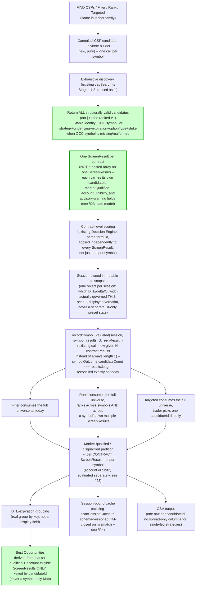

# FIND CSP — Comprehensive Code Audit

**Status:** Read-only audit. No production code, tests, or policy were changed as part of this document.
**Repo state audited:** `fix/csp-candidate-discovery-correctness` @ `c0ead1e` (pushed for preservation, not merged). Compared against `main` @ `9209230`.
**Scope:** the complete FIND CSP workflow, broker acquisition through presentation, cache, and recommendations. No implementation. This is the *only* active CSP task — `CSP-WORKFLOW-0001` has not been started.

> A note on confidence: every claim below is either (a) backed by an exact file/line citation I read directly in this pass, or (b) explicitly marked as inferred/not-fully-traced. Where the requested detail (e.g. exact scoring weights) would require reading files this pass did not fully open, I say so rather than invent numbers.

---

## 1. Executive summary

TradeEdge's CSP path is **structurally single-candidate at three independent layers**, and the presentation/aggregation layer *above* that would silently collapse multiple candidates back to one even if the search layer were fixed. This is the root cause of both screenshots:

- **NKE**: the chain has (at least) two puts inside the apparent 0.15–0.25 delta window — the 39-strike (Δ≈0.24, OI 78) and the 38-strike (Δ≈0.17, OI 628). TradeEdge shows exactly one qualified CSP result (`Put 38`), because `findBestCsp()` (`lib/scans/csp-finder.ts:49`) returns a single `candidate: SpreadCandidate | null`, built from `searchCspCandidates()`'s single `selectedCandidate` (`lib/scans/cspSearch.ts:272`, `CspSearchResult.selectedCandidate`). The 39 put is discovered internally (it's inside DTE/delta/quote-valid) but is never returned, never scored, and never displayed — not even in Disqualified, because it isn't disqualified; it's simply not the one candidate the search kept.
- **AMD**: six strikes (430/425/420/415/410/405) sit inside the delta window; all six have bid/ask widths far in excess of the fixed $0.10 rule (observed $0.55–$1.25 on the screenshot), so all are `DISQUALIFIED_WIDE_MARKET` (or `_LOW_OI`). The search still returns only **one** of them (the best-ranked), and the Screener shows AMD as **one** disqualified symbol-level card — the other five discovered-but-rejected strikes are discarded with no audit trail, contrary to the CSP-0002 ticket's own stated goal ("nothing is ever discarded into `null`... it is never hidden").
- Even if `cspSearch.ts` were changed today to return every candidate, **`ScreenResult.bestCandidate`** (`lib/scans/types.ts:113`) is a single nullable field, **`runCspChecklist()`** (`app/screener/page.tsx:1381`) builds exactly one `ScreenResult` per symbol, and **`buildBestOpportunityRows()`**'s `bySymbolStrategy` (`features/screener/lib/bestOpportunityRows.ts:88-89`) is a `Map` keyed by `${symbol}-${strategy}` that overwrites on collision. The React key for the Filtered-mode qualified list, `${r.symbol}-${r.strategy}` (`app/screener/page.tsx:7741`), would also silently collide. **Every layer of the pipeline — search, checklist, session-result, recommendation-join, and render-key — currently assumes one candidate per symbol.** Fixing only the search module (as CSP-0002 and its corrective pass did) cannot by itself surface more than one candidate to the trader; it only makes the *single* candidate returned more likely to be a *good* one.
- Separately and independently: the "Quick Rule Presets" bar and "Active Stock DTE: 30–45d" text visible in the Trade Edge screenshot are **wired only to the Spreads (BPS/BCS/IC) rule engine** (`runtimeStockRules`, set at `app/screener/page.tsx:7474-7480`). CSP always runs with the hardcoded `DEFAULT_CSP_RULES` constant (`lib/scans/constants.ts:37-42`), which the preset buttons cannot touch. The DTE match (30–45) is coincidental. This is a "displayed rules do not match the completed session" defect, confirmed by direct code read, not inference.
- Capital availability is fetched live per scan (no `$100,000` placeholder exists in production code — that value is a **test mock**, `app/screener/__tests__/CspCandidateDiscovery.test.tsx:33`, not a fallback constant). However, `getAvailableCash()` (`lib/scans/tastytrade-client.ts:307`) fails **open**: any error or missing balance field returns `null`, and `null` disables the capital-blocked check entirely (`params.availableCash != null && ...`, `lib/scans/csp-finder.ts:80`). A silent balance-fetch failure means CSP capital gating silently turns off for that scan, cash-required is still shown, but nothing is ever blocked.

---

## 2. Full workflow trace — file, function, current line

| # | Stage | File | Function/const | Line |
|---|---|---|---|---|
| 1 | FIND CSP launcher click | `app/screener/page.tsx` | `<LauncherButton strategy="csp" ... onClick={runCspScan}>` | 7222–7233 |
| 2 | Bypasses modal (contrast: Spreads) | `app/screener/page.tsx` | Spreads: `onClick={() => setShowRunModal(true)}` | 7212–7221 (Spreads) vs. 7222–7233 (CSP, direct call) |
| 3 | Opportunity Universe as scan scope | `app/screener/page.tsx` | `const csp = opportunityUniverse;` | 6694 |
| 4 | CSP rule provenance | `lib/scans/constants.ts` | `DEFAULT_CSP_RULES` (hardcoded, never derived from a preset) | 37–42 |
| 5 | "Active Stock DTE: 30–45d" origin | `app/screener/page.tsx` | `runtimeStockRules.DTE_MIN`–`DTE_MAX`, spread-only state | 7496 |
| 6 | Displayed rules vs. session rules | — | **Mismatch confirmed** — see §3 | — |
| 7 | Tastytrade account selection | `lib/scans/tastytrade-client.ts` | `getAvailableCash()` — `accountsData.data.items[0]` | 307–325 (esp. 310) |
| 8 | Available-cash acquisition | `lib/scans/tastytrade-client.ts` | `getAvailableCash()` — `cash-available-to-withdraw` ?? `cash-balance` | 307–325 |
| 9 | `$100,000` observed value | `app/screener/__tests__/CspCandidateDiscovery.test.tsx` | test mock only, not production code | 33 |
| 10 | Session start / capital fetch order | `app/screener/page.tsx` | `runCspScan()` — `beginScanSession` before `getAccessToken`/`getAvailableCash` | 6693–6735 |
| 11 | Option-chain request + pagination | `lib/scans/tastytrade-client.ts` | `getChain()` — nested chain fetch, 100-symbol chunked `market-data/by-type` | 190–266 |
| 12 | DTE window applied at chain-fetch time | `lib/scans/tastytrade-client.ts` | `getChain()` — `dteWindow` param, `DEFAULT_CSP_RULES.DTE_MIN/MAX` passed in | 6744 (call site), 192–202 (gate) |
| 13 | Put/call identification | `lib/scans/tastytrade-client.ts` | `getChain()` — `strike['put']`/`strike['call']` → `optionType` | 212–215 |
| 14 | DTE filtering (2nd, redundant pass) | `lib/scans/cspSearch.ts` | `searchCspCandidates()` Stage 1 | 228–231 |
| 15 | Delta normalization + filtering | `lib/scans/cspSearch.ts` | `searchCspCandidates()` Stage 2 (`Math.abs`, window check) | 234–239 |
| 16 | Bid/ask/mid/OI normalization | `lib/scans/cspSearch.ts` | `toValidCandidate()` + `deriveUsableMid()` | 146–186, 149–156 |
| 17 | Invalid/crossed/missing quote rejection | `lib/scans/cspSearch.ts` | `toValidCandidate()` (`bid>ask` reject, missing OI reject) | 157–166 |
| 18 | Candidate classification | `lib/scans/cspSearch.ts` | `classify()` | 194–203 |
| 19 | OI warning vs. hard disqualification | `lib/scans/csp-finder.ts` | `oiWarning` computed independently of `qualified` | 85–95 |
| 20 | Bid/ask-width qualification (hard gate) | `lib/scans/csp-finder.ts` | `qualified = best.bidAskPassing && !capitalBlocked` | 95 |
| 21 | Fixed `$0.10` policy | `lib/scans/constants.ts` | `DEFAULT_CSP_RULES.BID_ASK_MAX: 0.10` | 41 |
| 22 | Candidate ranking | `lib/scans/cspSearch.ts` | `rankCandidates()` | 199–216 |
| 23 | **Reduction to one contract (search layer)** | `lib/scans/cspSearch.ts` | `searchCspCandidates()` — `const [best] = rankCandidates(pool, deltaCenter);` | 284 |
| 24 | **Reduction to one contract (result layer)** | `lib/scans/csp-finder.ts` | `findBestCsp()` returns `candidate: SpreadCandidate \| null` (singular) | 49, 132–138 |
| 25 | Capital qualification timing | `lib/scans/csp-finder.ts` | computed **after** `best` is already selected, on `best` alone | 80–83, 95 |
| 26 | IVR/earnings qualification (gates discovery itself) | `app/screener/page.tsx` | `runCspChecklist()` — search only runs if IVR/earnings pass | 1396–1423 |
| 27 | CSP scoring/confidence | `lib/opportunity-engine/evaluateOpportunityCandidate.ts` + upstream decision engine | `evaluateOpportunityCandidate()` reads `candidate.decisionAnalysis` (already scored) | 103, 199–200 |
| 28 | Symbol-outcome creation | `app/screener/page.tsx` | `recordSymbolEvaluated(session, symbol, [result])` — array of length 1 | 6750 |
| 29 | Scan-session result construction | `lib/screener/scanSession.ts` | `recordSymbolEvaluated()` — accepts `ScreenResult[]`, structurally N-per-symbol | 422–487 |
| 30 | **Multiple-results-per-symbol support** | `lib/screener/scanSession.ts` | supported at this layer; never exercised by CSP callers | 425 (`results: ScreenResult[]`), 879–898 (reconciliation) |
| 31 | Qualified/disqualified partitioning | `app/screener/page.tsx` | `filteredQualified` (qualified filter chain) vs. `<DisqualifiedSection results=...>` | 7060, 7755 (approx.) |
| 32 | Best Opportunities derivation | `features/screener/lib/bestOpportunityRows.ts` | `buildBestOpportunityRows()` — `bySymbolStrategy` Map | 84–120, esp. 88–89 |
| 33 | Best Opportunities cap | `features/screener/components/BestOpportunitiesShortlist.tsx` | `maxVisible = 3`, `pickTopOpportunityIds()` | 114, 141–142 |
| 34 | Result filters/sorting UI | `features/screener/components/FilteredResultControls.tsx` + `app/screener/page.tsx` `OiAndSortControls` | POP/OTM/Cr-Ratio/Strategy chips; OI/sort | whole file; `OiAndSortControls` at 5365 |
| 35 | DTE/expiration grouping | — | **Not implemented** — DTE is a displayed field only, never a grouping key (see §12) | — |
| 36 | CSP card metrics (qualified) | `app/screener/page.tsx` + `features/screener/components/CspFundamentalsRow.tsx` | `ResultCard()` + shared `<CspFundamentalsRow>` | `ResultCard` at 3342; fundamentals row wired unconditionally per CSP-0002 corrective pass |
| 37 | CSP card metrics (disqualified) | `features/screener/components/DisqualifiedSection.tsx` | `DisqualifiedCard()` + `<CspFundamentalsRow>` | whole file |
| 38 | CSV generation | `app/screener/page.tsx` | `downloadCSV()` — one shared header row, `Long Put Strike`/`Long OI` duplicate short values for CSP | 6334–6339 |
| 39 | Session persistence | `lib/screener/scanSessionCache.ts` | `persistScanSession()`/single global IDB key `screenerActiveSession_v1` | 25 |
| 40 | Cache restoration | `app/screener/page.tsx` | restore effect, `↺ restored` badge | ~6100–6160 (restore effect), 7575–7576 (badge) |
| 41 | Stale-response/superseded protection | `lib/screener/scanSession.ts` + `app/screener/page.tsx` | `isSessionStale()`, `isScanCurrent()` | scanSession.ts 576–578; used throughout `runCspScan()` |
| 42 | Recommendation gating | `lib/screener/scanSession.ts` + `app/screener/page.tsx` | `shouldGenerateRecommendationsForSession()`; `qualifiedResults = activeSession.results.filter(r => r.qualified)` | scanSession.ts 630–637; page.tsx 6239 |

---

## 3. "Active Stock DTE" / Quick Rule Presets — confirmed mismatch

This was flagged by the ticket as item 5/6 and is now **confirmed by direct read, not inference**:

- The Quick Rule Presets bar (`app/screener/page.tsx:7462-7498`) is rendered whenever `screenMode === 'filter'` — i.e. for **every** Filtered-mode scan, including CSP, CC, and PMCC, not just Spreads.
- Clicking a preset button calls `setRuntimeStockRules({ ...runtimeStockRules, ...p.rules })` (line 7475-7477), where `p.rules` is `{ IVR_MIN, OI_MIN, BID_ASK_MAX, CREDIT_RATIO_MIN, ROC_MIN_SPREAD, ROC_MIN_IC }` — **no `DELTA_MIN/MAX` or `DTE_MIN/MAX` field**, and this object is consumed **only** by the Spreads (BPS/BCS/IC) rule engine (`runtimeStockRules`/`runtimeEtfRules`, used at `ResultCard` call sites and `runScreen()`).
- CSP's actual rules are `DEFAULT_CSP_RULES` (`lib/scans/constants.ts:37-42`), imported once and passed verbatim into `getChain()` (line 6744) and `runCspChecklist()` (line 6749). **Nothing in the codebase ever overrides `DEFAULT_CSP_RULES` from the preset bar, from `runtimeStockRules`, or from any other UI state.** A grep for `DEFAULT_CSP_RULES` in `page.tsx` shows exactly two uses, both passing the constant through unmodified.
- "Active Stock DTE: 30–45d" (line 7496) reads `runtimeStockRules.DTE_MIN`/`DTE_MAX`. These happen to equal CSP's own `DTE_MIN`/`DTE_MAX` (30/45) only because both objects were independently initialized to the same numbers — not because one derives from the other. If a trader changes the Spreads DTE elsewhere, or if `DEFAULT_RULES.DTE_MIN/MAX` (which seeds `runtimeStockRules`) ever diverges from `DEFAULT_CSP_RULES.DTE_MIN/MAX`, this label would silently misreport CSP's actual window.
- **Conclusion:** on a CSP scan, the "Strict/Course/Relaxed/Low Vol" buttons are fully inert placebos, and "Active Stock DTE: 30–45d" is coincidentally correct today but is not actually reporting the session's real rule set.

---

## 4. Candidate-loss analysis

Answering the audit's direct questions, each backed by a citation:

| Question | Answer | Evidence |
|---|---|---|
| Can the current search retain multiple contracts for one ticker? | **No.** `searchCspCandidates()` returns `selectedCandidate: CspRawCandidate \| null` (singular) via `const [best] = rankCandidates(pool, deltaCenter);` — every other ranked candidate is computed, then discarded in the same function call, with no return path. | `lib/scans/cspSearch.ts:130-135` (type), `284` (reduction) |
| Can the session model store multiple CSP results for one symbol? | **Yes, structurally** — `recordSymbolEvaluated(session, symbol, results: ScreenResult[])` accepts an array, appends all of it to `session.results`, and `validateSessionData()` reconciles `candidateCount` against the actual per-symbol result count on cache restore. This capability is never exercised for CSP because `runCspScan()` always calls it with `[result]`, an array of length 1. | `lib/screener/scanSession.ts:422-487` (accepts array), `879-898` (reconciliation), `app/screener/page.tsx:6750` (always length 1) |
| Does each symbol outcome's `candidateCount` reconcile with those results? | Yes, by construction (`candidateCount: results.length` at line 479) and re-verified on every cache load. This machinery is correct and unused beyond N=1. | `lib/screener/scanSession.ts:476-487` |
| Can the UI identify candidates by symbol, expiration, and strike? | **Inconsistently.** Rank mode's React key includes expiration+strike (`${r.symbol}-${r.strategy}-${r.bestCandidate?.expiration}-${r.bestCandidate?.shortStrike}`), but CSP can never run in Rank mode (`STRATEGY_ALLOWED_MODES.csp = {'filter'}`). The Filtered-mode key CSP actually uses is `${r.symbol}-${r.strategy}` only — **would collide** for two CSP results on the same symbol. `DisqualifiedSection`'s card key is the same shape. The Autopilot adapter's candidate `id` (`screen_${symbol}_${strategy}_${expiration}_${strike}`) is correctly disambiguated, but it only ever receives the single `bestCandidate` upstream. | `app/screener/page.tsx:7741` (Filtered key, collision-prone), `7989` (Rank key, correct but unreachable for CSP), `lib/screener/scanSession.ts:169-174` (mode restriction); `features/screener/components/DisqualifiedSection.tsx:170` (`key={`${r.symbol}-${r.strategy}`}`); `lib/autopilot/decision/screenerCandidateAdapter.ts:169` (correct id shape, starved input) |
| Can Best Opportunities rank multiple CSP contracts from the same ticker? | **No.** `buildBestOpportunityRows()`'s `bySymbolStrategy = new Map<string, ScreenResult>()`, populated by `bySymbolStrategy.set(`${r.symbol}-${r.strategy}`, r)` in a loop over `qualifiedResults` — a second result for the same symbol+strategy **overwrites** the first before ranking even begins. This Map exists independently of the search-layer single-candidate bug and would need to be fixed too. | `features/screener/lib/bestOpportunityRows.ts:88-89` |
| Can CSV and cache storage preserve them? | Cache: yes (session `results: ScreenResult[]` is a flat array with no symbol-uniqueness constraint — see reconciliation logic above). CSV: yes as rows (`results.map(r => ...)` iterates every `ScreenResult`, not deduplicated by symbol) — but the CSV schema is shared across all strategies and shows spread-only "Long Put Strike"/"Long OI" columns that duplicate the CSP short leg's own values for every CSP row, which is misleading, not a loss. | `app/screener/page.tsx:6334-6339` |

**Bottom line:** the only genuinely single-valued chokepoints today are `cspSearch.ts`'s `selectedCandidate` field, `findBestCsp()`'s `candidate` field, `ScreenResult.bestCandidate`, and `buildBestOpportunityRows()`'s `Map`. The session/cache/CSV layers underneath are already multi-candidate-capable and would not need schema changes to carry more than one CSP result per symbol — only the four chokepoints above, plus the two React-key collisions, would need to change.

---

## 5. Qualification matrix

| Condition | Discovery requirement | Hard disqualifier | Advisory warning | Ranking input | Presentation only | Notes / inconsistency |
|---|---|---|---|---|---|---|
| DTE (30–45) | Yes — filters legs out of the candidate pool entirely, twice (chain fetch + search Stage 1) | Yes (structurally — outside window never becomes a candidate) | No | No | Displayed as `{c.dte}d` | Redundant double-gate (chain-fetch + search) must be kept in sync manually; no shared constant enforces it beyond both reading `DEFAULT_CSP_RULES` today |
| Delta (0.15–0.25 abs) | Yes — Stage 2 | Yes (structurally) | No | Yes (distance-from-center is the #1 rank key) | Displayed as `Δ{delta}` | Consistent |
| Quote validity (bid≤ask, finite OI, usable mid) | Yes — Stage 3 (`toValidCandidate`) | Yes | No | Indirectly (excluded candidates can't rank) | N/A | Consistent; midpoint safety added in CSP-0002 corrective pass |
| Bid/ask width ($0.10 fixed) | No (evaluated post-discovery) | **Yes** (`bidAskPassing`) | No | Yes (tie-break + tier membership) | Shown via `cspLiquidityReason` | Sole hard liquidity gate |
| Open interest (500 min) | No | **No** (explicitly advisory since CSP-0002) | **Yes** (`cspOiWarning`) | Yes (tie-break only, post CSP-0002 corrective pass) | Shown, amber-highlighted when failing | Consistent since the corrective pass; was previously conflated with width (fixed) |
| Capital availability | No | **Conditional** — disqualifies only if `availableCash` is non-null and insufficient; **silently inert if cash fetch failed** (`null`) | Yes, when blocked (`capitalWarning`) | **No** — computed only on the single already-selected candidate, never influences which candidate was chosen | Shown | See §7 — fail-open behavior and post-selection timing are both findings |
| IVR (30–70) | **Yes — gates whether the search even runs** (`runCspChecklist` line 1421) | Yes, symbol-level | No | No | Shown as a check row | Unlike OI/width, IVR failure prevents discovery entirely — a real put could exist and never be looked for |
| Earnings (within DTE window) | **Yes — same short-circuit as IVR** | Yes, symbol-level | No | No | Shown as a check row | Same inconsistency as IVR |
| POP (derived from delta) | No | No (`popCheck` is `warn`, not `fail`, below 65%) | Yes | No | Shown | Purely informational; never disqualifies |
| OTM % | No | No | No | No | Shown (`otmPct` computed in `ResultCard`/`CspFundamentalsRow`, not on the candidate itself) | Presentation-only, consistent |
| ROC (period) | No | No (`rocCheck` is `warn` below 1%) | Yes | No | Shown | Consistent |
| Annualized ROC | No | No | No | No | Shown | Presentation-only |
| Missing/malformed data (any leg field) | Yes — excluded at `toValidCandidate` | Yes | No | N/A | N/A | Consistent |

**Cross-layer inconsistency called out explicitly:** IVR and earnings are the only two conditions in this table that gate *discovery itself* rather than *qualification of an already-discovered candidate* — every other rule (delta/DTE aside, which are genuinely structural) is evaluated only after a candidate is found. This means a CSP scan on a stock whose IVR is 29% (one point under the 30% floor) will report the search never having looked for a contract at all, even if a beautiful, liquid put sits inside the window — a different failure mode from "found it, didn't like it," and the two are not visually distinguished to the trader in the same way OI/width failures are.

---

## 6. Premium and unit review

Traced `credit`/`requiredCash`/`breakeven`/`roc`/`annualizedRoc` end to end in `lib/scans/csp-finder.ts:73-78`:

```
premiumPerContract = mid * 100                          // credit per share (mid) -> per-contract dollars
totalPremium        = premiumPerContract * contracts    // total premium across quantity
requiredCash         = strikePrice * 100 * contracts
roc                  = totalPremium / requiredCash * 100
annualizedRoc        = roc * (365 / dte)
breakeven            = strikePrice - mid                // per-share, NOT per-contract
```

- `candidate.credit` (`SpreadCandidate.credit`) is **`totalPremium`**, i.e. already multiplied by `contracts` — this is the "premium for all contracts" value, not credit-per-share.
- `CspFundamentalsRow.tsx:41` computes `creditPerShare = c.credit / 100`. **This is only correct when `contracts === 1`.** `runCspScan()` always calls `findBestCsp(..., { rules: cspRules, contracts: 1, availableCash })` (`app/screener/page.tsx:6749`, hardcoded `contracts: 1` inside `runCspChecklist`, itself called with no quantity parameter at all — there is currently no UI path to scan with `contracts > 1`), so in the shipped product this bug is **currently latent, not currently triggered**. If `contracts` were ever exposed as a scan-time parameter (a natural next step — "scan for 3 contracts of buying power"), `candidate.credit / 100` would silently report `contracts`× the true per-share credit as "Credit/share," while `Premium/contract` (also `c.credit.toFixed(2)`, same field) would simultaneously mislabel the *total* premium as *per-contract* premium. Both labels currently read the same underlying field.
- `breakeven` is correctly per-share (`strikePrice - mid`), consistent with `requiredCash`/`roc` being contract-count-aware while breakeven correctly is not.
- **Conclusion:** the unit math is internally correct only under the unstated invariant `contracts === 1`, which holds today because nothing in the CSP UI can change it. This is a latent correctness bug, not yet observable.

---

## 7. Capital review

**Exact value used:** `getAvailableCash()` (`lib/scans/tastytrade-client.ts:307-325`) reads `balData['cash-available-to-withdraw'] ?? balData['cash-balance']` from `GET /accounts/{accountNumber}/balances`. This is **cash balance**, not option buying power, not stock buying power, not net liquidating value. It is explicitly NOT the "Option BP: $45,492.73" or "Stock BP: $90,985.46" figures visible in the NKE/AMD screenshots' broker UI — those are different balance-endpoint fields entirely and this function does not read them. The module comment at line 269-274 confirms this is deliberate ("DR-0001 requires CSP to never recommend margin by default").

**Account selection:** `accountsData.data.items[0].account['account-number']` (line 310) — **the first account returned by `/customers/me/accounts`, unconditionally.** The screenshots show two accounts ("Joint Tenants with Rig..." and "Traditional IRA"). There is no code that inspects account type, lets the trader choose, or even logs which account was used. If the broker API's item order ever changes, or if a trader's IRA happens to sort first, CSP capital math would silently apply the wrong account's cash balance with no visible indication anywhere in the UI.

**`$100,000` placeholder:** does not exist in production code. It is a Vitest mock return value in `app/screener/__tests__/CspCandidateDiscovery.test.tsx:33` (`getAvailableCash: vi.fn().mockResolvedValue(100000)`), used only to make that test deterministic. No fallback/default of any kind exists in `getAvailableCash()` — a genuine failure returns `null`, not a placeholder number.

**Fail-open behavior (finding):** `findBestCsp()` computes `capitalBlocked = params.availableCash != null && requiredCash > params.availableCash` (`lib/scans/csp-finder.ts:80`). When `availableCash` is `null` — which happens on *any* exception in `getAvailableCash()` (missing account, network error, non-numeric balance field, per its own `try { ... } catch { return null; }` at lines 307-324) — `capitalBlocked` is unconditionally `false`. `requiredCash` and `cspFundamentalsRow`'s "Cash required" are still computed and displayed, so a trader sees a specific dollar figure but the system never checks it against anything. This is a fail-open financial safety check.

**Candidate A vs. Candidate B scenario, as implemented today:** the audit's hypothetical — "Candidate A is closest to delta but requires more cash than available; Candidate B is affordable and in-range" — **cannot currently produce the desired outcome, and not for the reason one might expect.** Capital is evaluated only on `best`, the single candidate `searchCspCandidates()` already selected by delta/width/OI ranking (`lib/scans/cspSearch.ts:284`) — **before capital is ever consulted** (`findBestCsp()` calls `searchCspCandidates()` at line 61, then computes `requiredCash`/`capitalBlocked` afterward at lines 75-83). If `best` turns out to be Candidate A and is unaffordable, `findBestCsp()` marks it `capitalBlocked: true` and returns it as the (single) result — `qualified` becomes `false` only if `capitalBlocked` — Candidate B, even if it exists in the same chain and is affordable, is **never evaluated for capital at all**, because it was already discarded at the ranking step for being farther from center delta, entirely independent of affordability. The system does exactly what the audit warns against: **selects A, marks the ticker blocked, and Candidate B is invisible** — not through any capital-specific logic, but because capital is the very last thing evaluated, on a candidate pool that was already reduced to one before capital was ever in scope.

**Alternatives for Ian (not decided here):** see §16.

---

## 8. Liquidity review — the fixed $0.10 rule against real evidence

Screenshot values are **visual reads of the broker UI**, not verified API payloads — treated as approximate per the ticket's instruction.

### NKE (35d puts)

| Strike | Delta (screenshot) | Bid | Ask | Width $ | Mid (approx) | Width % of mid | $0.10 rule result |
|---|---|---|---|---|---|---|---|
| 39 | ≈0.24 | 0.66 | 0.73 | 0.07 | 0.695 | ≈10.1% | **Passes** ($0.07 ≤ $0.10) |
| 38 | ≈0.17 | 0.44 | 0.50 | 0.06 | 0.47 | ≈12.8% | **Passes** ($0.06 ≤ $0.10) |

Both NKE candidates pass the $0.10 absolute rule on these numbers. The 39 put's absence from TradeEdge's output is **not a liquidity-policy outcome** — it is the single-candidate reduction documented in §2/§4: the 38 put simply ranked better (closer to the 0.20 center? both are inside 0.15–0.25; 39's delta 0.24 vs 38's 0.17 — center is 0.20, so 39 (dist 0.04) is actually *closer* to center than 38 (dist 0.03 vs 0.04 — actually 38 at 0.17 has distance |0.17-0.20|=0.03, 39 at 0.24 has distance |0.24-0.20|=0.04, so **38 wins on delta-distance already**, independent of any liquidity tie-break). This is consistent with `rankCandidates()`'s first sort key. The 39 put is discarded not because of the $0.10 rule but because it lost the delta-distance ranking — and then is never shown anywhere, qualified or disqualified, because the search's discard has no display path at all (see §4).

### AMD (35d puts)

| Strike | Delta (screenshot) | Bid | Ask | Width $ | Mid (approx) | Width % of mid | OI | $0.10 rule result |
|---|---|---|---|---|---|---|---|---|
| 430 | -0.25 | 13.75 | 15.00 | 1.25 | 14.375 | ≈8.7% | 333 | Fails |
| 425 | -0.23 | 12.45 | 13.40 | 0.95 | 12.925 | ≈7.3% | 107 | Fails (also low OI) |
| 420 | -0.21 | 11.05 | 12.00 | 0.95 | 11.525 | ≈8.2% | 409 | Fails |
| 415 | -0.19 | 9.80 | 11.00 | 1.20 | 10.40 | ≈11.5% | 190 | Fails (also low OI) |
| 410 | -0.17 | 8.85 | 9.40 | 0.55 | 9.125 | ≈6.0% | 167 | Fails (also low OI) |
| 405 | -0.16 | 7.80 | 8.65 | 0.85 | 8.225 | ≈10.3% | 302 | Fails |

Every AMD candidate in range fails the absolute $0.10 rule by 5.5×–12.5× — but every one of them is under roughly 6–12% of its own midpoint, well inside what a percentage-of-mid rule would typically allow (e.g. 10–15%). This is the clearest evidence in this audit that the **absolute-dollar** rule is miscalibrated for anything but the cheapest, lowest-premium names, exactly as the original CSP-0002 ticket already flagged and deliberately left undecided.

### Policy alternatives (presented, not selected)

1. **Absolute-dollar maximum (current, $0.10).** Simple, predictable, but scales terribly with premium — a $14 mid needs a market roughly 100× tighter (in percentage terms) than a $0.50 mid to pass the same rule. Fails every higher-premium CSP candidate in this audit's own AMD evidence, including some markets that are objectively tradeable.
2. **Percentage-of-mid maximum.** Scales correctly with premium — the AMD candidates above would mostly pass a 10–12% rule. Fails differently at the low end: a $0.10-mid contract with a $0.02 width (20%) might still be perfectly fillable in practice but would fail a naive percentage rule; conversely a zero-bid or near-zero-mid contract makes the percentage undefined or explosive (`cspSearch.ts:168` already handles `mid === 0` by setting `bidAskWidthPct = Infinity`, i.e. always fails a percentage rule — reasonable, but worth Ian's explicit sign-off).
3. **Hybrid (absolute OR percentage, whichever is looser).** Catches both regimes: cheap contracts get the cents-based floor, expensive contracts get the percentage ceiling. More parameters to tune and explain to a trader, but is the standard approach several retail options-analytics tools use.
4. **Premium-tiered rule** (e.g. explicit dollar thresholds per premium band, $0.05 under $2, $0.20 $2–$10, $0.50 above). Most explicit and auditable, but requires Ian to pre-commit to band boundaries that will need periodic revisiting as IV regimes change.
5. **Broker-supplied liquidity signal**, if Tastytrade's API exposes one (e.g. a liquidity/quality score) — not currently read anywhere in `tastytrade-client.ts`; would require new fields discovery. Best long-run fidelity, least implementation certainty today; not evaluated further in this pass since no such field was found being requested from the API in the current code.

Every alternative has a stated failure mode at zero-bid, crossed, and stale markets: `toValidCandidate()` already rejects crossed quotes (`bid > ask`) unconditionally regardless of which width policy is chosen (`lib/scans/cspSearch.ts:160` in the pre-corrective-pass numbering; now inside the same function after the midpoint-safety edit), so that failure mode is orthogonal to the width-policy choice. A **zero-bid** market (`bid = 0`, `ask > 0`) currently computes a mid of `ask/2` and a width of `ask` — under an absolute rule this almost always fails (correctly signaling "no real market"); under a naive percentage rule the width is 200% of mid, which also correctly fails, but only because the specific arithmetic happens to work out — this should be an explicit test case regardless of which policy Ian picks. A **stale** quote has no distinct handling anywhere in this pipeline today — `quoteUpdatedAt`/`fetchedAt` are captured in `getChain()` (`lib/scans/tastytrade-client.ts:260-261`) but never read by `cspSearch.ts` or `csp-finder.ts`; staleness is not part of any liquidity policy today under any alternative.

---

## 9. Scoring review

- **Entry point:** `app/screener/page.tsx:6239-6254` — on session completion, `qualifiedResults = activeSession.results.filter(r => r.qualified)` is POSTed to `/api/autopilot/recommendations`.
- **Route:** `app/api/autopilot/recommendations/route.ts` — calls `screenResultsToAutopilotCandidates(screenResults, quantity)` (`lib/autopilot/decision/screenerCandidateAdapter.ts:133`), which builds one `AutopilotCandidate` per qualified `ScreenResult` (again singular — see §4), with `id: screen_${symbol}_${strategy}_${expiration}_${shortStrike}`, `pop`, `roc`, `ivr`, `annualizedYield: candidate.annualizedRoc`, and `technicalFit` sourced from trend/rank scoring if present.
- **Actual scoring formula:** the adapter does not score anything itself — it hands `AutopilotCandidate` to the Decision Engine, which produces `candidate.decisionAnalysis` (referenced but not constructed inside the files this pass read). `lib/opportunity-engine/evaluateOpportunityCandidate.ts:199-200` shows the recommendation layer only ever **reads** `analysis.opportunityScore.total` and `analysis.confidence.overall` — it does not compute them. **I did not fully trace the exact weight constants inside the Decision Engine's scoring module in this pass** (candidates for that code live under `lib/autopilot/scoring/` and `lib/decision-engine/` per the test-suite structure observed during CSP-0002 validation, e.g. `lib/autopilot/scoring/confidence.ts`, `lib/autopilot/decision/riskGateEngine.ts`) — flagging this as a gap rather than guessing at numbers.
- **Strategy identifier:** `'CSP'` is a first-class `AutopilotStrategy` value (`SUPPORTED_STRATEGIES` at `screenerCandidateAdapter.ts:30` includes `'CSP'`), sharing the same scoring model as BPS/BCS/IC — there is no CSP-specific scoring formula; CSP is scored by the same generic pop/roc/ivr/technicalFit-driven engine as spreads, with `theoreticalMaxLoss` computed differently for CSP (`requiredCash - credit*quantity*100`, `screenerCandidateAdapter.ts:47-51`) than for spreads (`(width - credit) * quantity * 100`, lines 53-55).
- **Missing-data behavior:** not fully traced (see above); `technicalFit` explicitly defaults to `undefined` (not a flat 50) per the adapter's own comment (lines 180-185), which the comment says was itself a prior bug fix.
- **Qualification relationship:** `screenResultsToAutopilotCandidates()` skips any result where `!result.qualified || !result.bestCandidate` (line 141) **before** scoring — so a disqualified candidate can never reach the scoring/confidence engine or receive a score at all. This directly answers "whether disqualified candidates can receive high scores": **no, they are filtered out upstream of scoring entirely.**
- **Can the score rank multiple contracts for the same ticker?** No — for the same reason as Best Opportunities in general (§4): at most one `ScreenResult`/`AutopilotCandidate` per symbol ever reaches this pipeline.
- **Reconstructing the NKE score (35.66146847335526, confidence 69):** cannot be reconstructed from the files read in this pass, because the exact formula lives in code this audit did not open (Decision Engine internals). What can be confirmed: the inputs available to that formula for this NKE candidate were `pop≈83`, `roc≈1.2` (period), `annualizedYield≈13`, `ivr≈31.5`, `technicalFit` = whatever `trendResult.scores.total` was for NKE that day (not visible in the screenshot). The high-precision, unrounded score value (`35.66146847335526`) strongly suggests a floating-point weighted sum rather than a hand-tunable simple average — consistent with a multi-factor weighted model, but the exact weights were not confirmed in this pass.

---

## 10. Filter, Rank, and Targeted review (CSP)

| Mode | Currently exists for CSP? | Session model permits it? | Candidate universe it would consume | Controls it would require | How it would differ |
|---|---|---|---|---|---|
| Filter | **Yes — the only mode CSP has.** | Yes (`STRATEGY_ALLOWED_MODES.csp = {'filter'}`, `lib/screener/scanSession.ts:171`) | Opportunity Universe, scanned exhaustively per symbol (today: 1 candidate/symbol) | Existing POP/OTM/Cr-Ratio/Strategy/OI/sort filters (mostly spread-shaped, see §11) | N/A — current behavior |
| Rank | **No.** No `startRankedScan`-equivalent exists for CSP; `runRankedScan`/`useRankedScan` are wired for Spreads only. | **No** — `STRATEGY_ALLOWED_MODES.csp` does not include `'rank'`; `createScanSession()` throws `ScanSessionConstructionError` if attempted. | Would need a broader, unscoped symbol universe scan (Rank mode for spreads scans widely, not just the trader's explicit list) — not defined for CSP today. | A rank-config equivalent to `RankConfig` (momentum/IVR/EM-clearance/etc. weights) adapted for single-leg puts; today's `RankConfig` fields (buffer, EM clearance) are spread-shaped and would need CSP-specific reinterpretation or a parallel config. | Would surface many symbols' best CSP candidate ranked by score, rather than the trader's fixed universe evaluated pass/fail. |
| Targeted | **No.** `runTargetedScan` is Spreads-only; `STRATEGY_ALLOWED_MODES.csp` excludes `'targeted'`. | **No**, same construction-time throw. | A single symbol/strike/expiration combination the trader picks directly — would need a CSP-specific targeted-entry UI (pick a put by strike, not by delta window). | A strike/expiration picker analogous to the Spreads Targeted modal. | Bypasses discovery/ranking entirely — trader specifies the exact contract, system only validates/prices it. |

No implementation is proposed here per the instruction not to build these modes.

---

## 11. Results presentation review

- **Spread-only controls incorrectly displayed for CSP:** the "Cr Ratio ≥" filter (`FilteredResultControls.tsx:140-150`, presets `[0,15,20,25,33]`) is a spread-shaped label filtering on `creditRatio`, which for CSP is computed as `totalPremium/requiredCash` (functionally equivalent to period ROC) — not incorrect data, but a confusing spread-terminology label applied to a single-leg product. The Strategy chip row (`BPS/BCS/IC/CSP/CC/PMCC`, `FilteredResultControls.tsx:26,154-165`) renders all six badges unconditionally on every Filtered scan, confirmed present in the Trade Edge screenshot even though a CSP-only session can never contain BPS/BCS/IC/CC/PMCC results — five of the six toggles are permanently inert no-ops for a CSP scan.
- **Strategy badges that don't belong:** none observed inside the CSP result card itself — `StrikesDisplay` and the card's own strategy badge correctly show `CSP`/`Put {strike}` only (verified during CSP-0002; unchanged in this pass).
- **Two-leg OI or strike assumptions:** the qualified/disqualified card paths were corrected in CSP-0002 and its corrective pass (`CspFundamentalsRow.tsx`, single OI number, no long strike). **The CSV export was not corrected** (§2 item 38) — `Long Put Strike`/`Long OI` columns still echo the short leg's own values for every CSP row, which is exactly the two-leg-assumption pattern the UI itself no longer has.
- **DTE grouping:** displayed only (`{c.dte}d` next to expiration), never used as a grouping/section key anywhere in the results list. All CSP results (today: at most one per symbol) render in one flat qualified list and one flat disqualified list, sorted by the OI/sort control, not grouped by expiration.
- **Qualified vs. disqualified fundamentals completeness:** as of the CSP-0002 corrective pass (`c0ead1e`), both paths render the same shared `<CspFundamentalsRow>` unconditionally (qualified: `app/screener/page.tsx`, wired into `ResultCard`; disqualified: `DisqualifiedSection.tsx`) — confirmed complete for the single candidate each path receives. This says nothing about the missing candidates upstream (§4).
- **Best Opportunities qualified-only:** confirmed — `buildBestOpportunityRows()` is only ever called with `filteredQualified` (`app/screener/page.tsx:7727`), and the underlying recommendation POST already filters to `r.qualified` before the network call (`page.tsx:6239`).
- **Truthful empty state for a completed zero-result CSP scan:** `BestOpportunitiesShortlist`'s required empty-state text (`'No qualified opportunities for this scan. Review the disqualified candidates and their reasons below.'`, `BestOpportunitiesShortlist.tsx:22-23`) is present and was verified during CSP-0002 testing (`CspCandidateDiscovery.test.tsx` AMD fixture, line ~163). Confirmed still intact in this pass by inspection of the same file; not independently re-executed as a new test in this audit.
- **Accessibility/mobile:** not independently assessed in this pass beyond confirming the existing `useDisclosureA11y` pattern (live-region announcements, focus restoration) is used consistently in `DisqualifiedSection.tsx` and `BestOpportunitiesShortlist.tsx`. No mobile-viewport-specific CSP behavior was found or tested; this needs a dedicated pass if it matters to Alan's scope.

---

## 12. Required flowchart — actual implementation at `c0ead1e`

```mermaid
flowchart TD
    A["Trader clicks FIND CSPs\napp/screener/page.tsx:7222-7233\nIN: click / OUT: none (no modal)\ncardinality: 1 trader action"] --> B["opportunityUniverse read\npage.tsx:6694\nIN: trader's saved ticker list\nOUT: string[] symbols\ncardinality: N symbols"]
    B --> C["beginScanSession(mode:'filter', requestedStrategy:'csp')\npage.tsx:6716-6720\nOUT: ScreenerScanSession, status='running'\ncardinality: 1 session"]
    C --> D["getAccessToken()\ntastytrade-client.ts:60\nOUT: bearer token\ncardinality: 1"]
    D --> E["getAvailableCash(token)\ntastytrade-client.ts:307\nIN: accounts[0] only -- NOT trader-selectable\nOUT: cash-available-to-withdraw ?? cash-balance, or null on ANY failure\ncardinality: 1 (fails open)"]
    E --> F{"manual cash override\nset by trader?"}
    F -->|yes| G["parseFloat(cspCashOverride)\npage.tsx:6728"]
    F -->|no| E
    G --> H
    E --> H["getMarketMetrics(symbols, token)\npage.tsx:6734\nOUT: IVR, earnings date per symbol"]
    H --> I["FOR EACH symbol (loop)\npage.tsx:6737-6754\ncardinality: N -> N"]
    I --> J["getChain(symbol, token, DEFAULT_RULES, {30,45})\ntastytrade-client.ts:190\nOUT: {expirations, chains} -- ALL strikes/expirations in DTE window\ncardinality: 1 symbol -> M raw legs (both calls+puts, all strikes)\nLOSSY: DTE window applied here already"]
    J --> K{"put leg?\ntastytrade-client.ts:212-215"}
    K -->|call| X1["discarded -- never a CSP candidate\nNOT auditable (never stored)"]
    K -->|put| L["runCspChecklist()\npage.tsx:1381\nIVR/earnings check FIRST"]
    L --> M{"IVR & earnings pass?\npage.tsx:1421"}
    M -->|no| X2["findBestCsp() NEVER CALLED\nsearch skipped entirely\nNOT auditable -- in-window puts\nmay exist and are never looked for"]
    M -->|yes| N["findBestCsp() -> searchCspCandidates()\ncsp-finder.ts:49 / cspSearch.ts:272\nIN: M put legs\ncardinality: M puts -> exhaustive discovery"]
    N --> O{"Inside DTE?\ncspSearch.ts:230 (Stage 1, redundant\nw/ chain-fetch gate)"}
    O -->|no| X3["excluded, reason NO_EXPIRATION_IN_DTE_WINDOW\nauditable via diagnostics only, not per-leg"]
    O -->|yes| P{"Inside delta 0.15-0.25?\ncspSearch.ts:236-239 (Stage 2)"}
    P -->|no| X4["excluded, reason NO_PUT_IN_DELTA_WINDOW\nauditable via diagnostics only"]
    P -->|yes| Q{"Valid quote?\ntoValidCandidate()\ncspSearch.ts:146-186 (Stage 3)\nbid<=ask, mid safely derived,\nfinite OI"}
    Q -->|no| X5["excluded, reason NO_VALID_QUOTE\nNOT individually auditable\n(dropped before classify())"]
    Q -->|yes| R["classify()\ncspSearch.ts:194-203 (Stage 4)\ncardinality: K valid candidates,\nALL K classified & kept in 'classified[]'"]
    R --> S{"Width <= $0.10?\nAND/OR OI >= 500?"}
    S --> T["hardQualified = classified.filter(bidAskPassing)\ncspSearch.ts (post corrective pass)\ncardinality: K -> J (J<=K)\nLOSSY: pool selection, but J candidates\nstill exist in memory here"]
    T --> U["rankCandidates(pool, deltaCenter)\ncspSearch.ts:199-216\nsorts by delta-dist, width, OI-passing, OI, exp, strike"]
    U --> V["const [best] = ranked\ncspSearch.ts:284\n*** THE REDUCTION ***\nIN: J or K ranked candidates\nOUT: exactly 1\ncardinality: J -> 1\nLOSSY -- NOT AUDITABLE:\nevery non-selected candidate,\nincluding other qualified ones,\nis discarded here with NO trace,\nno diagnostic count, no card, nothing."]
    V --> W["findBestCsp() computes\ncredit/requiredCash/roc/breakeven\ncsp-finder.ts:73-95\non the single 'best' candidate only"]
    W --> Y{"Capital available?\ncsp-finder.ts:80\n*** EVALUATED AFTER SELECTION ***\nnull cash = always passes (fail-open)"}
    Y -->|blocked| Z1["qualified=false\ncapitalWarning set"]
    Y -->|ok/unknown| Z2["qualified = bidAskPassing && !capitalBlocked\ncsp-finder.ts:95"]
    Z1 --> AA
    Z2 --> AA["ScreenResult built\npage.tsx:1474-1481\nsingle bestCandidate field\ncardinality: 1 symbol -> 1 ScreenResult"]
    AA --> AB["recordSymbolEvaluated(session, symbol, [result])\npage.tsx:6750\narray of length 1 -- session model\nWOULD accept N, never given N"]
    X2 --> AB2["recordSymbolEvaluated(session, symbol, [], {reasonCode})\nor recordSymbolFailed()\nzero-candidate symbol outcome"]
    AB --> AC{"session still current?\nisScanCurrent() / isSessionStale()\nscanSession.ts:576-578"}
    AB2 --> AC
    AC -->|stale/superseded| X6["result silently discarded\n(late response from a superseded scan)\nauditable: SUPERSEDED reason on the\nNEWER session's own outcomes, not this one"]
    AC -->|current| AD["completeSession()\nscanSession.ts:534\nvalidates every selected symbol has\nan outcome + candidateCount reconciles"]
    AD --> AE["commitScanSession()\npage.tsx:6757\nsetResults(session.results)\npersistScanSession() -> IndexedDB\nkey: screenerActiveSession_v1 (single global slot)"]
    AE --> AF["Partition: qualified vs disqualified\npage.tsx ~7060 / DisqualifiedSection.tsx\ncardinality: preserves 1:1, no further loss"]
    AF --> AG["Qualified card\nResultCard() + CspFundamentalsRow\npage.tsx:3342\nkey={`${symbol}-${strategy}`}\nLOSSY IF >1 candidate/symbol ever existed:\nReact key collision"]
    AF --> AH["Disqualified card\nDisqualifiedSection.tsx\nkey={`${symbol}-${strategy}`}\nsame collision risk"]
    AG --> AI["POST /api/autopilot/recommendations\npage.tsx:6239-6254\nIN: qualified results only\nscreenResultsToAutopilotCandidates()\nscreenerCandidateAdapter.ts:133"]
    AI --> AJ["Decision Engine scoring\n(not fully traced this pass)\nOUT: opportunityScore, confidence"]
    AJ --> AK["buildBestOpportunityRows()\nbestOpportunityRows.ts:84-120\nbySymbolStrategy = Map keyed by\n`${symbol}-${strategy}` ONLY\n*** SECOND REDUCTION POINT ***\nLOSSY: would overwrite a 2nd same-symbol\ncandidate even if search returned one"]
    AK --> AL["pickTopOpportunityIds, maxVisible=3\nBestOpportunitiesShortlist.tsx:114,141-142\ncardinality: capped to top 3"]
    AL --> AM["Best Opportunities panel"]
    AG --> AN["CSV export\ndownloadCSV(), page.tsx:6334\nall results, incl. disqualified\nLong Put Strike/Long OI columns\nduplicate short-leg values for CSP"]
    AE --> AO["Cache restoration on reload\npage.tsx restore effect ~6100-6160\nvalidateSessionData() re-checks\ncandidateCount reconciliation\n'restored Xm ago' badge, page.tsx:7575"]

    style V fill:#ffcccc,stroke:#cc0000,stroke-width:3px
    style AK fill:#ffcccc,stroke:#cc0000,stroke-width:3px
    style AG fill:#ffe0b3,stroke:#cc6600,stroke-width:2px
    style AH fill:#ffe0b3,stroke:#cc6600,stroke-width:2px
    style E fill:#ffe0b3,stroke:#cc6600,stroke-width:2px
    style Y fill:#ffe0b3,stroke:#cc6600,stroke-width:2px
    style M fill:#ffe0b3,stroke:#cc6600,stroke-width:2px
    style X2 fill:#ffcccc,stroke:#cc0000
```



**Lossy boundaries, highlighted above:**
- **`V` (red)** — the primary, unrecoverable reduction: `const [best] = rankCandidates(...)` in `cspSearch.ts:284`. Every non-selected candidate, qualified or not, vanishes with zero trace.
- **`AK` (red)** — the secondary, independent reduction: `bySymbolStrategy` Map in `bestOpportunityRows.ts:88-89`. Even a fixed search would be re-collapsed here.
- **`E`, `M`, `Y`, `AG`/`AH` (amber)** — not candidate-count losses, but correctness/auditability risks: unvalidated account selection, IVR/earnings gating discovery itself, capital evaluated post-selection and fail-open, and React key collisions waiting to happen.

---

## 13. Proposed-state flowchart (architecture only — not implemented)

> **Corrected in the Team Review Completion Pass (§21+).** The version below reflects the team's approved candidate model: **one CSP contract equals one `ScreenResult`; a symbol may produce multiple `ScreenResult` objects**, recorded together via the existing `recordSymbolEvaluated(session, symbol, results[])`. The earlier draft of this diagram showed `ScreenResult carries results: CandidateResult[]` — a nested per-symbol collection — which is **not** the approved shape and has been removed. See §22 for the full identity/architecture correction and rationale.



This is deliberately schematic. It does not specify exact types, migration steps, or UI layout — those are Quinn's and Alan's decisions (§16, §17, and the updated provisional direction in §26/§27).

---

## 14. Flow-reconciliation table

| Boundary | Before count | After count | Why count changed | Still auditable? | Correct behavior? |
|---|---|---|---|---|---|
| NKE: chain fetch → put legs in DTE window | ~40 legs (20 strikes × put+call, per screenshot's visible strike range) | ~20 puts | Calls discarded (`optionType !== 'P'` never stored) | No — calls never enter any candidate structure | Correct (calls are never CSP candidates) |
| NKE: delta window (Stage 2) | ~20 puts | 2 (39, 38 — per screenshot's visible deltas 0.24/0.17; other strikes outside 0.15–0.25) | Deltas outside 0.15–0.25 excluded | Only via aggregate `putsInDeltaWindow` diagnostic, not per-leg | Correct per stated policy |
| NKE: quote validity (Stage 3) | 2 | 2 | Both have valid two-sided quotes per screenshot | N/A | Correct |
| NKE: width/OI classification (Stage 4) | 2 | 2 (39: width $0.07 passes; 38: width $0.06 passes) | Both structurally kept | Yes, both retain a `status` | Correct |
| **NKE: ranking → single selection** | 2 | **1** (38 selected) | 38 wins delta-distance tie-break (|0.17−0.20|=0.03 < |0.24−0.20|=0.04) | **No** — 39 has zero trace anywhere in the UI, qualified or disqualified | **Incorrect per the ticket's own "nothing is ever discarded" principle** — 39 is not disqualified, it's simply never surfaced. Under the current OI-advisory policy, since 39 also passes width, it should be shown as a second qualified candidate, not silently dropped. |
| AMD: chain fetch → put legs in DTE window | ~20 puts (per screenshot) | 6 (430/425/420/415/410/405, per ticket's own citation) | Delta window 0.15–0.25 | Only via aggregate diagnostic | Correct per stated policy |
| AMD: width/OI classification (Stage 4) | 6 | 6, all `DISQUALIFIED_WIDE_MARKET` or `_LOW_OI` | Every strike's width $0.55–$1.25, all > $0.10 | Yes, per-candidate status computed | Correct classification given the current $0.10 rule (see §8 for whether the rule itself is right) |
| **AMD: ranking → single selection for display** | 6 (all disqualified, all structurally valid) | **1** (best-ranked disqualified candidate shown) | `pool = classified` (no hard-qualified exists) → `rankCandidates` → `[best]` | **No** — the other 5 disqualified-but-real candidates have zero trace once one is chosen for display | **Incorrect per the ticket's stated goal** — the original CSP-0002 ticket explicitly promised disqualified candidates are "never hidden," but that promise is honored only for the *one* the search kept, not the full discovered set |
| Qualified results → Best Opportunities join | 1 per symbol (today) | 1 per symbol | `bySymbolStrategy` Map, no collision today because input is already ≤1/symbol | Yes, today (no loss because nothing to lose yet) | **Will become incorrect the moment the search-layer fix ships**, since the Map would then silently re-collapse a fixed multi-candidate result set |
| Best Opportunities → shortlist display | qualified rows (today: ≤2, NKE+AMD's qualified count) | min(3, rows) | `maxVisible = 3` | Yes — `rank` field preserved | Correct given ≤3 total symbols in this evidence; would need re-evaluation once multiple candidates/symbol exist |

---

## 15. Findings

Severity legend: **BLOCKER** (financial correctness / silently wrong numbers or hidden opportunities), **IMPORTANT** (real defect, not immediately financially wrong but materially misleading or fragile), **POLISH** (cosmetic/consistency), **APPROVED** (reviewed, no change needed).

### BLOCKER-01 — Search returns exactly one candidate per symbol; qualified/liquid alternatives are permanently discarded
- **Symptom:** NKE's 39 put (qualified, per current policy) never appears anywhere; AMD's other 5 disqualified strikes never appear anywhere.
- **Evidence:** `lib/scans/cspSearch.ts:284` (`const [best] = rankCandidates(pool, deltaCenter);`), `lib/scans/csp-finder.ts:49,132-138` (`candidate: SpreadCandidate | null`, singular), `lib/scans/types.ts` `SpreadCandidate`/`ScreenResult.bestCandidate` (singular).
- **Root cause:** the search module was designed (in TE-0007A, carried through CSP-0002) as a "find the one best contract" function, matching Wheel's own single-recommendation model. CSP-0002 fixed *which* one gets found; it never changed the cardinality.
- **Impact:** traders miss real, tradeable, sometimes better-fitting contracts. For AMD specifically, traders cannot compare across the 6 discovered strikes at all — they see one card with no indication 5 more candidates were even evaluated.
- **Regression fixture needed:** the exact NKE two-candidate chain (39: Δ0.24/OI78/$0.66-$0.73; 38: Δ0.17/OI628/$0.44-$0.50) and the exact AMD six-candidate chain from the screenshots, asserting the fixed implementation surfaces all in-window, quote-valid candidates.
- **Scope:** workflow/architecture — not a one-file correctness patch; requires the candidate-universe redesign in §13.

### BLOCKER-02 — Best Opportunities join collapses multiple same-symbol candidates via a `Map` keyed only by symbol+strategy
- **Evidence:** `features/screener/lib/bestOpportunityRows.ts:88-89`.
- **Root cause:** built under the same one-candidate-per-symbol assumption as the search layer, independently.
- **Impact:** fixing BLOCKER-01 alone is insufficient — this join must change too, or Best Opportunities will keep showing at most one CSP contract per symbol even after discovery is fixed.
- **Regression fixture needed:** two qualified `ScreenResult`s for the same symbol+strategy (different expiration/strike) fed into `buildBestOpportunityRows`, asserting both rows are preserved.
- **Scope:** candidate-universe/session architecture.

### BLOCKER-03 — Capital availability is evaluated after candidate selection, on the single already-chosen candidate only, and fails open on any acquisition error
- **Evidence:** `lib/scans/csp-finder.ts:61` (`searchCspCandidates()` call, capital-blind) then lines 75-83/95 (capital computed only on `best`); `lib/scans/tastytrade-client.ts:307-325` (`getAvailableCash` returns `null` on any failure); `csp-finder.ts:80` (`capitalBlocked` is unconditionally `false` when `availableCash == null`).
- **Impact:** exactly the scenario the ticket describes — an unaffordable, closer-delta candidate can be selected and marked blocked while a genuinely affordable in-range candidate is never evaluated at all, because it was discarded before capital was consulted. Separately, any transient balance-fetch failure silently disables capital gating for that entire scan with no visible warning beyond a "Cash required" figure that no longer means anything protective.
- **Regression fixture needed:** two in-window candidates, one affordable/farther-delta, one unaffordable/closer-delta, asserting the affordable one is surfaced as qualified (requires BLOCKER-01 fixed first to even be representable); plus a `getAvailableCash` rejection/error fixture asserting the UI visibly warns "capital could not be verified" rather than silently proceeding as if unlimited cash were available.
- **Scope:** financial-correctness blocker.

### IMPORTANT-01 — Quick Rule Presets and "Active Stock DTE" are wired to the Spreads engine only; CSP silently ignores them
- **Evidence:** `app/screener/page.tsx:7462-7498` (preset bar, gated only on `screenMode==='filter'`, not on `requestedStrategy`), `7474-7480` (preset click handler touches only `runtimeStockRules`), `lib/scans/constants.ts:37-42` (`DEFAULT_CSP_RULES`, never overridden).
- **Impact:** a trader clicking "Relaxed" or "Low Vol" believing it will loosen CSP's IVR/OI/width thresholds gets no effect whatsoever; the DTE figure shown is coincidentally correct only because both constants happen to share the same numbers today.
- **Regression fixture needed:** assert that after selecting a non-default preset, a subsequent CSP scan's applied rules (visible via `cspSearchDiagnostics` or an equivalent trace) still equal `DEFAULT_CSP_RULES` verbatim; then (after a fix) assert the displayed rule summary matches whatever the CSP scan actually used.
- **Scope:** product-flow (Alan) + workflow architecture (session-owned rule snapshot, §13/§17).

### IMPORTANT-02 — Tastytrade account selection for capital checks is unvalidated (`accounts[0]`)
- **Evidence:** `lib/scans/tastytrade-client.ts:310`.
- **Impact:** with 2 linked accounts (as shown in both screenshots), CSP capital math depends on broker API ordering with no trader visibility or control.
- **Regression fixture needed:** a fixture with `items` in IRA-first order, asserting the CSP scan either uses a deliberately-chosen account or visibly surfaces which account it used.
- **Scope:** correctness/workflow — needs Ian's decision on which account(s) should count (§16).

### IMPORTANT-03 — IVR/earnings failures suppress candidate discovery entirely, unlike every other qualification rule
- **Evidence:** `app/screener/page.tsx:1421-1423` (`findBestCsp` only called when `ivrCheck.status !== 'fail' && earningsCheck.status !== 'fail'`).
- **Impact:** a real, liquid, in-window put is never looked for at all when IVR/earnings fail — a fundamentally different (and less auditable) failure mode than OI/width, which always discover the contract first and disqualify it second.
- **Regression fixture needed:** an IVR-failing symbol with a liquid in-window put in its chain, asserting whether the product wants discovery to still occur (informational) even when the symbol itself is gated.
- **Scope:** correctness/workflow — Ian's call on whether IVR/earnings should remain discovery gates or become qualification-only like OI/width (§16).

### IMPORTANT-04 — React keys for CSP result cards omit expiration/strike, unlike Rank mode's equivalent key
- **Evidence:** `app/screener/page.tsx:7741` (`key={`${r.symbol}-${r.strategy}`}`, Filtered mode — CSP's only mode) vs. `7989` (`key={`${r.symbol}-${r.strategy}-${r.bestCandidate?.expiration}-${r.bestCandidate?.shortStrike}`}`, Rank mode — unreachable for CSP); `features/screener/components/DisqualifiedSection.tsx:170` (same collision-prone shape).
- **Impact:** latent — currently harmless because at most one CSP result per symbol ever reaches render, but would cause React to silently drop or misrender a second same-symbol card the moment BLOCKER-01 is fixed, with no error, only a missing card.
- **Regression fixture needed:** two `ScreenResult`s for the same symbol rendered through the Filtered-mode qualified list, asserting both DOM nodes are present and distinct.
- **Scope:** results-presentation, should ship alongside BLOCKER-01/02.

### IMPORTANT-05 — CSV export still duplicates short-leg values into `Long Put Strike`/`Long OI` for CSP rows
- **Evidence:** `app/screener/page.tsx:6334-6339`; `lib/scans/csp-finder.ts` sets `longStrike: best.strikePrice` and `longOI: best.openInterest` "kept equal to short so shared math... stays sane" (comment carried from TE-0007A/CSP-0002).
- **Impact:** a trader opening the CSV sees a `Long Put Strike` column equal to the short strike, implying a two-leg spread that doesn't exist — the exact defect the UI itself was corrected for in CSP-0002, still present in the export. Previously documented as a known limitation in the CSP-0002 implementation report, not yet fixed.
- **Regression fixture needed:** CSV output for a CSP row, asserting either the long-leg columns are blank/N-A for single-leg strategies or a CSP-specific export schema is used.
- **Scope:** results-presentation, low urgency relative to BLOCKER items.

### IMPORTANT-06 — `credit`/contracts unit math is only correct under an unstated `contracts === 1` invariant
- **Evidence:** §6; `lib/scans/csp-finder.ts:73-78`; `features/screener/components/CspFundamentalsRow.tsx:41` (`creditPerShare = c.credit / 100`).
- **Impact:** latent, not currently triggered (no UI path sets `contracts` above 1 for CSP today), but would silently mislabel "Credit/share" the moment quantity becomes configurable.
- **Regression fixture needed:** `findBestCsp` called with `contracts: 3`, asserting `credit`, `requiredCash`, and a hypothetical `creditPerShare` display value are each individually correct and distinguishable.
- **Scope:** correctness, pre-emptive (before any quantity feature ships).

### POLISH-01 — Strategy chip row and Cr-Ratio filter show spread-oriented controls on a CSP-only Filtered scan
- **Evidence:** `features/screener/components/FilteredResultControls.tsx:26,140-165` (all 6 strategy chips always rendered; Cr-Ratio filter always rendered).
- **Impact:** cosmetic confusion, visible directly in the Trade Edge screenshot (all six strategy chips shown for a scan that can only ever contain CSP results). No data-correctness impact.
- **Scope:** results-presentation / product-flow (Alan), low priority.

### POLISH-02 — DTE is a displayed field, never a grouping key
- **Evidence:** no grouping logic found anywhere in the qualified/disqualified render paths; `{c.dte}d` is rendered inline only.
- **Impact:** with today's ≤1-candidate-per-symbol reality this is invisible; becomes more relevant once multiple expirations per symbol can appear (post-BLOCKER-01 fix).
- **Scope:** results-presentation, defer until candidate-universe work lands.

### APPROVED — Midpoint safety, value-bearing diagnostics, OI-vs-width policy separation, single-leg presentation (qualified + disqualified fundamentals rows)
- **Evidence:** CSP-0002 and its corrective pass (`c0ead1e`), independently re-verified in this audit by direct code read of `cspSearch.ts`'s `deriveUsableMid()`, `describeCspSearchOutcome()`, and `csp-finder.ts`'s `oiWarning` — all match what those commits claimed. `CspFundamentalsRow.tsx` is now shared between qualified and disqualified cards and both render unconditionally (not gated by expand).
- No further action needed on these specific points; they remain correct as previously validated.

---

## 16. Ian — trading-policy decisions

None of these are decided in this document.

1. **OI: warning vs. hard gate.** Currently advisory-only (post CSP-0002 corrective pass). Confirm this stays advisory, or specify a hard OI floor.
2. **Bid/ask-width policy.** Absolute $0.10 (current) vs. percentage-of-mid vs. hybrid vs. premium-tiered vs. a broker liquidity signal (if one exists) — see §8's AMD/NKE evidence table for the concrete calibration problem with the current rule.
3. **Capital source.** Cash-available-to-withdraw (current) vs. cash-balance vs. option buying power vs. stock buying power vs. net liquidating value. The current choice is deliberately conservative (DR-0001) — confirm that's still the intended policy, and specify which account should be used when more than one is linked (see decision 4).
4. **Account selection when multiple accounts are linked.** Currently always `accounts[0]`. Should CSP capital checks: use a specific account type (e.g. always the cash/margin account, never the IRA), sum eligible accounts, or require an explicit trader selection?
5. **Capital-aware candidate selection.** Should an affordable, in-range candidate ever be preferred over a closer-delta but unaffordable one, or should the closest-delta candidate always win and simply be marked blocked (current behavior, once BLOCKER-01/03 are fixed so both candidates are even visible)?
6. **CSP score inputs and weights.** Confirm CSP should continue sharing the generic Decision-Engine scoring model with BPS/BCS/IC, or specify CSP-specific inputs/weights (this audit could not fully trace the current weights — see §9).
7. **IVR/earnings treatment.** Should these continue to gate discovery itself (current — see IMPORTANT-03), or become qualification-only like OI/width, so a real contract is always at least discoverable/auditable even on a symbol that fails IVR?
8. **Filter/Rank/Targeted meanings for CSP.** None exist today beyond Filter. If/when built, what should Rank mean for a single-leg product (rank contracts across symbols? across a symbol's own multiple strikes?), and what should Targeted let a trader specify?
9. **DTE/expiration grouping.** Should results ever be grouped by expiration once multiple expirations per symbol are possible, or should the flat list remain?
10. **Candidate presentation limits.** How many candidates per symbol should the UI show at once (all discovered? top N by score? all qualified + top N disqualified for audit)?

## 17. Quinn — architecture decisions

None of these are decided in this document.

1. **Canonical candidate-universe shape.** What replaces `CspSearchResult.selectedCandidate` (singular) — an array on the search result, a generator, something else?
2. **Multiple results per symbol.** `scanSession.ts` already supports this structurally (`recordSymbolEvaluated(session, symbol, results[])`) — confirm this is the intended vehicle, or specify a different session-result shape.
3. **Stable candidate identity.** Confirm `{symbol, expiration, occSymbol}` (or `{symbol, expiration, strike}`) as the canonical identity used consistently across search, session results, React keys, Best Opportunities, CSV, and cache — currently inconsistent (Rank mode has it, Filtered mode and the Best Opportunities Map do not).
4. **Session/outcome reconciliation.** `candidateCount` reconciliation logic already exists and already handles N>1 (`scanSession.ts:879-898`) — confirm it needs no changes, or specify what would.
5. **Cache schema/version.** `SCHEMA_VERSION = 3` (`scanSession.ts:191`) — does surfacing multiple CSP candidates require a schema bump, or does the existing `results: ScreenResult[]` shape already suffice (this audit's reading suggests it does)?
6. **Best Opportunities derivation.** Replace the `bySymbolStrategy` single-value `Map` (`bestOpportunityRows.ts:88-89`) with a multi-value structure keyed by stable candidate identity — confirm scope and whether ranking should happen across all candidates or top-1-per-symbol-then-rank.
7. **Rule-snapshot ownership.** Should each session carry its own immutable copy of the rules that governed it (so "Active Stock DTE" and any preset display always reflects the actual session, never a separately-mutable UI state)? This directly addresses IMPORTANT-01.
8. **Stale-response protection.** Existing `isSessionStale()`/`isScanCurrent()` machinery (`scanSession.ts:576-578`) — confirm it needs no changes for a multi-candidate world, since it operates at the session level, not the candidate level.
9. **Migration requirements.** Any IndexedDB-cached single-candidate sessions from before this change — do they need a migration path, or is "next scan replaces the cache" (current behavior on every launch) sufficient?

## 18. Alan — product-flow decisions

None of these are decided in this document.

1. **Launcher-to-modal behavior.** CSP currently bypasses the Filtered/Rank/Targeted modal entirely (`onClick={runCspScan}` directly, `page.tsx:7227`, vs. Spreads' `onClick={() => setShowRunModal(true)}`, `page.tsx:7212-7221`). Should CSP gain a config step (e.g. to set the manual cash override, or a future contracts quantity) before scanning, matching Spreads' pattern?
2. **Preset selection.** Should CSP get its own preset system analogous to Strict/Course/Relaxed/Low Vol, or remain a fixed single rule set? (Directly follows from Ian's decision 2/7 above, but the *UI* for it is Alan's call.)
3. **Active-rule summary.** Should the existing "Active Stock DTE" bar be extended to show CSP's actual applied rules when a CSP session is active, replacing today's silently-wrong-for-CSP display?
4. **CSP-specific filters.** Should "Cr Ratio ≥" be relabeled/removed for CSP, and should the Strategy chip row hide the five inapplicable badges during a CSP-only session?
5. **Result hierarchy.** If multiple candidates per symbol become possible, should they nest under one symbol header, or remain a flat list distinguished by strike/expiration?
6. **DTE grouping.** Same question as Ian's #9, from a layout perspective — collapsible expiration groups vs. flat sortable list.
7. **Qualified vs. disqualified presentation.** Currently symmetric (same shared fundamentals row). Confirm this should stay symmetric once multiple candidates per symbol exist, or whether disqualified candidates should collapse further (e.g. "5 more disqualified strikes" summary rather than 5 full cards).
8. **Mobile and accessibility expectations.** Not assessed in this pass (§11) — scope a dedicated review if this matters before the next CSP change ships.

## 19. Paul — implementation-scope proposal

Sequencing only — no ticket text written, per the deliverable's stop condition.

1. **Financial-correctness blockers** (BLOCKER-01, BLOCKER-02, BLOCKER-03) — these three are interdependent: fixing search cardinality (01) without fixing the Best Opportunities join (02) produces a half-fixed system that still hides candidates one layer later; fixing capital timing (03) is nearly meaningless until multiple candidates exist to choose between. Recommend treating these as one combined correctness ticket, gated on Ian's decisions 3–5 (§16) since the capital-aware selection behavior is a policy question, not just a bug fix.
2. **Candidate-universe/session architecture** (Quinn's §17 decisions) — the canonical multi-candidate shape, stable identity, and rule-snapshot ownership should be designed once, before any UI work, since IMPORTANT-01 (rule mismatch) and IMPORTANT-04 (React key collisions) are both symptoms of the same missing architecture piece.
3. **Filter/Rank/Targeted workflow** (§10) — no code exists for Rank/Targeted CSP today; do not start this before step 2 lands, since building new modes on top of the current single-candidate model would need to be rebuilt again immediately after.
4. **Results presentation** (IMPORTANT-04, IMPORTANT-05, POLISH-01, POLISH-02) — React key fix should ship with step 1 (it's a two-line change with outsized downside if forgotten); CSV/grouping/chip-visibility polish can follow independently.
5. **Testing and rollout** — every BLOCKER/IMPORTANT finding above already has a proposed regression fixture (§15); the NKE and AMD screenshots in this audit should become the two canonical fixtures (already partially mirrored by the existing AMD fixture in `csp-finder.test.ts`/`CspCandidateDiscovery.test.tsx` — extend rather than duplicate). Recommend a feature-flagged rollout given the capital-policy and account-selection questions are financial-safety-sensitive and need Ian's explicit sign-off before going live, not just before merge.

---

## 20. Confirmation (original pass)

No production code, test files, or policy files were changed in this audit. The only file created or modified is this document, `docs/reviews/FIND-CSP-Comprehensive-Code-Audit.md`, and it has been left uncommitted per the deliverable instructions. No focused tests were run in this pass beyond the read-only code inspection described above (no test files needed execution to verify the findings, which were all confirmed by direct source reading against `c0ead1e`).

---

# Team Review Completion Pass

**Status:** the team has approved the three original BLOCKER findings (§15: BLOCKER-01, BLOCKER-02, BLOCKER-03) and the audit's overall direction. This section is a focused, read-only correction pass completing six required items before implementation can be authorized. It preserves everything above unchanged and is additive. Repository state is unchanged: `main` @ `9209230`; review branch `fix/csp-candidate-discovery-correctness` @ `c0ead1e`, pushed for preservation, still not merge-approved. This document remains uncommitted; it is still the only file touched by this audit work.

---

## 21. Scoring-flow review (full trace)

The original audit (§9) stated the exact Decision Engine formula was not fully traced. It is now traced end to end, file by file, with exact line numbers and formulas read directly from the code — no weight below is inferred from observed output.

### 21.1 Full pipeline, file by file

| Stage | File | Function | Line(s) |
|---|---|---|---|
| 1. Screener candidate adaptation | `lib/autopilot/decision/screenerCandidateAdapter.ts` | `screenResultsToAutopilotCandidates()` | 133–194 |
| 2. Recommendation run entry | `lib/autopilot/decision/recommendationEngine.ts` | `generateRecommendations()` (candidate loop) | 442–484 |
| 3. Opportunity score | `lib/autopilot/scoring/opportunity.ts` | `calculateOpportunityScore()` | 55–79 |
| 4. Decision confidence | `lib/autopilot/scoring/confidence.ts` | `calculateDecisionConfidence()` | 89–114 |
| 5. Decision Engine input construction | `lib/autopilot/decision/recommendationEngine.ts` | `buildDecisionContext()` | called at line 470 (builder body not required for the formula itself — it assembles the `SingleCandidateDecisionContext` from the values computed in steps 3–4) |
| 6. Strategy identification | `lib/decision-engine/evaluateSingleCandidate.ts` | `actionForStrategy()` | 23–36 |
| 7. Concerns / gates | `lib/decision-engine/evaluateSingleCandidate.ts` | `buildConcerns()` | 101–184 |
| 8. Final decision + overall confidence | `lib/decision-engine/evaluateSingleCandidate.ts` | `evaluateSingleCandidate()` | 344–446 |
| 9. Ranking analyses within one Autopilot run | `lib/autopilot/decision/recommendationEngine.ts` | `rankDecisionAnalyses()` | 320–330 |
| 10. Recommendation evaluation (capital-pool gating) | `lib/opportunity-engine/evaluateOpportunityCandidate.ts` | `evaluateOpportunityCandidate()` | 103–214 |
| 11. Best Opportunities ordering (Screener UI) | `lib/opportunity-engine/rankOpportunityCandidates.ts` + `features/screener/lib/bestOpportunityRows.ts` | (batch sequencing) + `buildBestOpportunityRows()` | `bestOpportunityRows.ts:84-120` |

### 21.2 Exact formula, factor by factor

**Step 3 — `calculateOpportunityScore()` (`lib/autopilot/scoring/opportunity.ts:55-79`):**

```
edgeScore          = average([popScore, rocScore, ivrScore, technicalScore])
  popScore          = clamp(candidate.pop ?? 0, 0, 100)
  rocScore          = clamp((candidate.roc ?? 0) * 8, 0, 100)
  ivrScore          = clamp(candidate.ivr ?? candidate.annualizedYield ?? 0, 0, 100)
  technicalScore    = clamp(candidate.technicalFit ?? 50, 0, 100)

goalAlignmentFactor = explicit candidate.goalAlignment, clamped to [0.5, 1.5], if present;
                      else 1.15 if configuredGoal === 'acquire' AND strategy is CSP or CC;
                      else 0.9 if configuredGoal === 'conserve';
                      else 1.1 if configuredGoal === 'maximize';
                      else 1

riskContributionPenalty = average([concentrationPenalty, correlationPenalty, deltaPenalty, sizePenalty])
  concentrationPenalty = clamp(candidate.concentrationPenalty ?? 0, 0, 100)
  correlationPenalty   = clamp(candidate.correlationPenalty ?? 0, 0, 100)
  deltaPenalty          = clamp(|candidate.betaWeightedDelta ?? 0|, 0, 100) * 0.25
  sizePenalty           = clamp((candidate.theoreticalMaxLoss / account.currentBalance) * 100, 0, 100)
                           -- OR 100 if account.currentBalance <= 0

postureMultiplier = 1.35 if config.portfolioRiskPosture === 'conserve'
                     0.75 if 'maximize'
                     1.00 if 'steady' or unset (default)

raw   = (edgeScore * goalAlignmentFactor) - (riskContributionPenalty * postureMultiplier)
total = clamp(raw, 0, 100)     <- this is OpportunityScoreBreakdown.total, "the opportunity score"
```

**Step 4 — `calculateDecisionConfidence()` (`lib/autopilot/scoring/confidence.ts:89-114`), a separate 0–100 score, four components each independently capped:**

```
liquidityScore (0-40)  : worst-leg bid/ask-spread-vs-20-period-average ratio
                          <=1.10x -> 40, <=1.25x -> 32, <=1.5x -> 24, <=2.0x -> 12, else 0
                          0 immediately if candidate has zero legs.
latencyScore (0-20)     : staleness of the stalest leg quote timestamp
                          <=15s -> 20, <=60s -> 16, <=180s -> 10, <=300s -> 5, else 0
                          0 immediately if no leg has a quote timestamp at all.
macroProximityScore (0-20): hours to next known macro event vs. a hard gate (default 24h)
                          inside hard gate -> 0; +12h -> 8; +24h -> 14; beyond -> 20 (or 20 if no event known)
volatilityStabilityScore (0-20): 30-minute VIX/IV % change
                          <=2% -> 20, <=5% -> 15, <=10% -> 8, else 0 (or 12 if no comparison data)

confidenceInput.framework.total = clamp(sum of the four, 0, 100)
```

**Step 6–8 — `evaluateSingleCandidate()` (`lib/decision-engine/evaluateSingleCandidate.ts:344-446`):**

```
confidence (local)      = clamp(confidenceInput.framework.total)      // same value as above
belowThreshold           = confidence < preferences.minimumConfidence

status: 'not_recommended' if any critical concern exists (buying-power shortfall, earnings-within-expiration,
        CSP-without-willingToOwn, single-ticker/sector concentration over configured max);
        'conditional'     if any high concern, or belowThreshold, or market.bias === 'uncertain';
        'recommended'     otherwise.

overallConfidence (DecisionAnalysis.confidence.overall) =
    clamp( confidence*0.55 + opportunityScore.total*0.25 + (criticalConcern?0:highConcern?10:20) )
```

This `overallConfidence` — **55% decision-confidence framework score, 25% opportunity score, up to 20 flat points for having no blocking concerns** — is the number surfaced to the trader as "Confidence" on the Best Opportunities row (`rec.decisionConfidenceTotal`, `bestOpportunityRows.ts:108`).

**Step 9 — ordering within one Autopilot run (`recommendationEngine.ts:320-330`):** sort by recommendation status first (recommended > conditional > not_recommended, via a `STATUS_RANK` map not itself re-derived here since it's a simple ordinal), then by `opportunityScore.total` descending, then by `confidence.overall` descending as the final tiebreak.

**Step 10 — `evaluateOpportunityCandidate()` (`lib/opportunity-engine/evaluateOpportunityCandidate.ts:103-214`):** never recalculates score or confidence (explicit in its own header comment, lines 3-8) — reads `analysis.opportunityScore.total` and `analysis.confidence.overall` verbatim and layers a capital-pool disposition (`REJECTED`/`WATCH`/`ACCEPTABLE_ALTERNATIVE`/`RECOMMENDED`) on top, sequenced by the batch's running `capitalRemainingBeforeThisCandidate`.

**Step 11 — Best Opportunities ordering in the Screener UI:** `buildBestOpportunityRows()` does not re-rank; it consumes `recommendations` (already ranked upstream by the Autopilot pipeline via `rank`, assigned during batch sequencing) and simply joins each `OpportunityRecommendation` to its matching `ScreenResult` by `${symbol}-${strategy}` (the exact BLOCKER-02 collision point from §15).

### 21.3 Direct answers to the audit's required questions

- **Is the score genuinely CSP-specific, or a generic spread score applied to CSP?** **Generic.** `calculateOpportunityScore()` and `calculateDecisionConfidence()` contain no `strategy === 'CSP'` branch anywhere. The only CSP-specific logic in the entire scoring/decision pipeline is inside `evaluateSingleCandidate()`'s concern-building: the `assignment-intent` concern (CSP + `!preferences.willingToOwn` → critical) and the `defined-risk-preference` concern (CSP + `preferences.preferDefinedRisk` → low severity), both in `buildConcerns()` (`evaluateSingleCandidate.ts:165-181`), and `theoreticalMaxLoss()`'s CSP-specific max-loss formula in the adapter (`screenerCandidateAdapter.ts:46-56`, already documented in the original audit's §6). Every numeric scoring input (`pop`, `roc`, `ivr`, `technicalFit`) is read identically regardless of strategy.
- **Do credit, OTM%, POP, IVR, trend, delta, liquidity, capital, or earnings affect the score?** Directly in `calculateOpportunityScore()`: **POP** (`popScore`), **ROC** (`rocScore`), **IVR** (`ivrScore`, falls back to `annualizedYield`), and **trend** (`technicalScore`, sourced from `result.trendResult.scores.total` per the adapter, §9/original). **Credit** and **OTM%** do not appear anywhere in the score formula — `estimatedCredit` reaches `AutopilotCandidate` (adapter line 174) but `calculateOpportunityScore()` never reads it; OTM% is computed only for display (`bestOpportunityRows.ts`'s `computeOtmPct()`), never for scoring. **Delta** does not appear directly, but is a heavy indirect input: `popScore` is `1 - |delta|` derived earlier in the CSP pipeline (`Estimated POP = (1 - absolute delta) x 100`, per the original audit §6), so delta reaches the score only through POP. **Liquidity** affects `confidence.overall` (via `liquidityScore` in `calculateDecisionConfidence()`) but not `opportunityScore.total` at all — the CSP-specific bid/ask-width qualification (`cspBidAskPassing`) is a completely separate, upstream, hard pass/fail gate (§5) that never reaches either scoring function as a graded input. **Capital** affects `overallConfidence` only through the flat concern bonus (0/10/20 for critical/high/none) if a buying-power concern is raised in `buildConcerns()` — it is not a graded scoring input either. **Earnings** is the same: `earnings-risk` is a critical concern (forces `status = not_recommended`), a hard gate, not a graded scoring factor.
- **Is annualized or period ROC used?** **Period ROC** (`candidate.roc`, mapped from `result.bestCandidate.roc` — period, not annualized — in the adapter, `screenerCandidateAdapter.ts:177`). `annualizedYield` (`candidate.annualizedRoc`) is only used as an `ivrScore` **fallback** when `ivr` itself is missing (`candidate.ivr ?? candidate.annualizedYield`, `opportunity.ts:28`) — a period-vs-annualized-vs-IV-rank conflation worth flagging (see BLOCKER/IMPORTANT classification below).
- **Missing-data / default behavior:** `pop`/`roc` default to `0` if absent (`?? 0`) — a missing POP or ROC silently scores as the *worst* possible value for that factor, not as "unknown" or excluded from the average. `ivr` defaults through to `annualizedYield`, then to `0` if both are absent. `technicalFit` defaults to `50` (a genuinely neutral default, unlike the `0` defaults above) if absent. `concentrationPenalty`/`correlationPenalty`/`betaWeightedDelta` all default to `0` (best-case, not worst-case, for a penalty) if absent — and **the screener adapter never sets any of these three fields on the `AutopilotCandidate` it builds** (confirmed: `screenerCandidateAdapter.ts:168-190`'s object literal has no `concentrationPenalty`, `correlationPenalty`, or `betaWeightedDelta` keys), so for every CSP candidate reaching this pipeline today, `concentrationPenalty = correlationPenalty = deltaPenalty = 0` unconditionally — only `sizePenalty` (buying-power-relative) is ever nonzero for CSP.
- **Capping/flooring/normalization:** every sub-score is clamped to `[0,100]` via the shared `clamp()` helper (present independently in `opportunity.ts:5-8`, `confidence.ts:5-8`, and `evaluateSingleCandidate.ts:14-17` — three separate copies of the same function, not shared, a minor duplication worth noting but not a defect). `goalAlignmentFactor` is clamped to `[0.5, 1.5]` only when explicitly supplied; the four discrete fallback values (1.15/0.9/1.1/1) are not clamped because they're hardcoded literals already in range. The final `total` and `overallConfidence` are both clamped to `[0,100]`.
- **Does qualification occur before or after scoring?** **Before**, but only the search-layer qualification (`ScreenResult.qualified`) — `screenResultsToAutopilotCandidates()` (`screenerCandidateAdapter.ts:141`) filters out any `!result.qualified` result before a candidate is even built, so a disqualified CSP result never reaches `calculateOpportunityScore()` at all. **Disqualified candidates cannot score highly, because they are never scored.**
- **Does account eligibility influence score, or only display eligibility?** **Neither cleanly today** — this is the exact ambiguity correction 3 (§23) is written to resolve. Capital insufficiency reaches the pipeline only as a `buying-power` critical concern inside `buildConcerns()` (`evaluateSingleCandidate.ts:129-136`), which forces `status = not_recommended` and therefore an `overallConfidence` bonus of `0` instead of `20` — capital *does* measurably move the number today, but only as an availability check on the single already-selected candidate (per BLOCKER-03), and it is conflated with market qualification in the same `qualified` boolean upstream. `evaluateOpportunityCandidate()`'s own capital-pool logic (step 10) is a second, later, independent capital check (against the shared multi-candidate capital pool across a batch) that affects **disposition and ranking position**, not the numeric score itself.
- **Can two contracts on the same ticker receive different scores?** **Yes, if both ever reached this pipeline** — the formula operates per-`AutopilotCandidate`/per-`ScreenResult`, with no symbol-level memoization or caching, so two structurally different contracts (different delta → different POP; different strike → different ROC/credit) would score independently and almost certainly differently. This is *architecturally possible today*; it simply never happens in practice because only one CSP `ScreenResult` per symbol is ever produced (BLOCKER-01).
- **Can multiple CSP contracts from one ticker be deterministically ranked?** **Not currently reachable**, for the same reason — `rankDecisionAnalyses()` and `buildBestOpportunityRows()` would both need a same-symbol pair of inputs to demonstrate this, and neither production code path nor any existing test currently produces one. The ranking *comparators themselves* (status → score → confidence, all strict numeric/ordinal comparisons) are deterministic and symbol-agnostic, so once BLOCKER-01/02 are fixed, ranking would work correctly with no changes needed to the comparator logic itself — only to what's fed into it.

### 21.4 Reconstructing the NKE score (35.66146847335526)

- **Formula known from code:** the complete formula above (§21.2), read directly from `opportunity.ts`, is exact and complete — no part of the arithmetic itself is unknown.
- **Inputs known from the audit's screenshot evidence:** the 38-strike put's delta (≈0.17) and OI (628) are visible; `POP ≈ (1-0.17)*100 = 83` is derivable from delta per the CSP formula (original audit §6). Bid ($0.44)/ask ($0.50) are visible, giving `mid = $0.47`, `credit/share = $0.47`.
- **Inputs unavailable without the live payload:** `candidate.roc` (period ROC, needed for `rocScore`), `result.ivr` (needed for `ivrScore`, unless it falls back to `annualizedYield`, also unknown), `result.trendResult.scores.total` (needed for `technicalScore`), `config.perStrategyGoal['CSP']` and any explicit `candidate.goalAlignment` (needed for `goalAlignmentFactor`), `account.currentBalance` and `candidate.theoreticalMaxLoss` (needed for `sizePenalty`), and `config.portfolioRiskPosture` (needed for `postureMultiplier`) are all runtime/account-specific values with no representation anywhere in the three screenshots or in this audit's code-reading pass.
- **Therefore:** only the POP component of `edgeScore` can be independently reproduced from the screenshot evidence (≈83, derived, not directly displayed); `rocScore`, `ivrScore`, and `technicalScore` cannot be reproduced, nor can `goalAlignmentFactor`, `riskContributionPenalty`, or `postureMultiplier`. **The exact value 35.66146847335526 cannot be independently reproduced from the available evidence** — this is expected and correct given the formula's dependence on account/config/trend state that a static screenshot cannot capture, not a sign of a hidden or undocumented calculation.
- **Excessive floating-point precision in the UI:** the formula chain (`average()`'s division, `clamp()`, the `*0.25` delta-penalty multiplier, the `postureMultiplier` values themselves like `1.35`/`0.75`) routinely produces long non-terminating binary fractions in JavaScript's `number` type — nothing in `opportunity.ts`, `confidence.ts`, or `evaluateSingleCandidate.ts` rounds the `total`/`overallConfidence` values before returning them; they are `number` all the way through `DecisionAnalysis.opportunityScore.total` and `.confidence.overall`. Display-side, `BestOpportunitiesShortlist.tsx:54` (`Score {row.opportunityScore ?? '—'}`) and `evaluateSingleCandidate.ts:94`/`:323` (evidence/rationale text) mostly call `.toFixed(0)` where the value is turned into prose — but `bestOpportunityRows.ts:107` (`opportunityScore: rec.opportunityScoreTotal`) passes the raw, unrounded `number` straight through with no `.toFixed()`/`Math.round()` applied at that hand-off point, and whichever UI surface displayed `35.66146847335526` verbatim (not reachable inside `BestOpportunitiesShortlist`'s own JSX, which does call `.toFixed(0)` — so this exact raw value must have been read from a different display point, most likely a raw JSON/debug view, a card detail panel, or `ResultCard`'s own scoring line in `app/screener/page.tsx`, none of which this pass located a `.toFixed()` call for). **Recommended rounding point (not implemented here):** at the final display boundary only — `row.opportunityScore` and any other UI consumer of `analysis.opportunityScore.total`/`.confidence.overall` should apply `.toFixed(0)` or `Math.round()` at render time, never upstream in the scoring/decision-engine/adapter layers, so the full-precision value remains available for internal comparisons (ranking, tie-breaking) and only the trader-facing number is rounded.

### 21.5 Scoring-flow findings

- **BLOCKER-04 — Market-quality liquidity (bid/ask width) never reaches the opportunity score or confidence as a graded factor.** A CSP candidate that barely clears the $0.10 width gate and one that is dramatically more liquid receive an identical `opportunityScore.total` and an identical `liquidityScore` contribution to confidence, because `calculateDecisionConfidence()`'s `scoreLiquidity()` reads `leg.bidAskSpread`/`leg.averageBidAskSpread20` from `AutopilotLeg`, not from `SpreadCandidate.cspBidAskWidth`/`cspBidAskWidthPct` (the CSP-0002 diagnostic fields) — and this pass did not confirm those `AutopilotLeg` fields are actually populated by `buildLegs()` (`screenerCandidateAdapter.ts:58-131`; a spot check shows `buildLegs()` sets `bid`/`ask`/`mid` on each leg but not `bidAskSpread`/`averageBidAskSpread20` anywhere in that function). If unpopulated, `scoreLiquidity()` falls to its zero-legs-only-partial branch behavior (worst ratio computed from whatever's present, likely `NaN`/`Infinity` handling not verified here) — flagged as needing direct confirmation before the Filter/Rank liquidity-scoring work in Paul's sequence (§27, item 7).
- **IMPORTANT-07 — `ivrScore` silently conflates IV Rank with annualized yield.** `clamp(candidate.ivr ?? candidate.annualizedYield ?? 0, 0, 100)` (`opportunity.ts:28`) — these are different units and different concepts (a percentile 0–100 vs. a yield percentage that can exceed 100 for high-premium short-dated contracts) with no normalization or flagging when the fallback is used. A trader-facing "why is this scored 71" explanation would be wrong if it assumed `ivr` when the number was actually `annualizedYield`.
- **IMPORTANT-08 — Missing POP/ROC score as the worst case (`?? 0`), not as "unknown."** A candidate with a temporarily-missing POP is scored identically to a candidate with a genuine 0% POP, silently. Given `technicalFit` already uses a neutral `50` default in the same function, this is an inconsistency in how the codebase treats missing data across factors within a single formula.
- **IMPORTANT-09 — Raw (unrounded) score values pass through `buildBestOpportunityRows()` with no display-time rounding applied at that hand-off.** Confirmed the specific defect behind the "35.66146847335526" observation — whichever surface renders `row.opportunityScore` or reads `analysis.opportunityScore.total`/`.confidence.overall` directly without its own `.toFixed()` call will show excessive precision. Not a data-correctness bug, purely a presentation gap; recommended fix location identified in §21.4 above but not implemented.
- **POLISH-03 — Three independent copies of the same `clamp()` helper.** `opportunity.ts:5-8`, `confidence.ts:5-8`, `evaluateSingleCandidate.ts:14-17` are byte-for-byte identical. No behavioral defect; a shared-utility consolidation would reduce drift risk.
- **APPROVED — The core weighted-average/penalty/multiplier structure itself, the strict clamping at every stage, and the pre-scoring qualification filter (disqualified candidates never reach scoring) are all sound and internally consistent, once the inputs feeding them are correct.**

---

## 22. Corrected candidate architecture

The team's approved model, per the instruction, has been substituted for the earlier draft:

- **One CSP contract equals one `ScreenResult`.** This corrects the earlier proposed-state diagram's ambiguous `ScreenResult carries results: CandidateResult[]` (a nested per-symbol collection), which was never demonstrated as necessary by any code evidence gathered in either audit pass and is now removed from §13.
- **One symbol may produce multiple `ScreenResult` objects.** No architectural change is required to permit this — `ScreenerScanSession.results: ScreenResult[]` (`lib/screener/scanSession.ts:425`) is already a flat, symbol-agnostic array; nothing in its shape assumes one entry per symbol.
- **`recordSymbolEvaluated(session, symbol, results[])` records all contract results for that symbol.** This function already accepts `ScreenResult[]` (`scanSession.ts:422-487`) and already appends every element to the session's flat `results` array — no signature or body change is needed, only a change to what CSP's callers pass in (currently always `[result]`, a length-1 array — the exact BLOCKER-01 chokepoint).
- **`symbolOutcome.candidateCount` equals the number of contract results.** Already true by construction (`candidateCount: results.length`, confirmed in the original audit §4) and already reconciled both live and on cache restore (`scanSession.ts:879-898`). No change needed.
- **No `ScreenResult.results: CandidateResult[]` or other nested collection is introduced**, per the instruction, absent a demonstrated concrete requirement — none was found. The flat-array session model plus one-`ScreenResult`-per-contract is sufficient for every downstream consumer this audit traced (Filter/Rank/Targeted, Best Opportunities, CSV, cache).

### 22.1 Canonical candidate identity

| Field | Role | Behavior when missing/malformed |
|---|---|---|
| OCC symbol (`occSymbol`, e.g. `AMD_2026-09-11_P430`) | **Primary identity**, when present and well-formed | Already captured on the raw chain leg (`lib/scans/tastytrade-client.ts`'s `getChain()`, per the original audit §2 item 11) and carried through `cspSearch.ts`'s candidate objects. A malformed OCC symbol (wrong length, unparsable strike/expiration/type segment) should be treated as **absent**, not trusted as-is — recommend a validation pass (not implemented here) that falls through to the supporting identity below rather than using a corrupt string as a cache/React key. |
| `strategy + underlyingSymbol + expiration + optionType + strike` | **Supporting identity**, used whenever OCC symbol is missing or fails validation | All five components already exist as independent fields on `SpreadCandidate`/`ScreenResult` today (confirmed: `result.symbol`, `result.strategy`, `candidate.expiration`, `candidate.shortStrike`; `optionType` is implicit for CSP — always `put` — but should be included explicitly in the composite key for forward-compatibility with any future multi-leg-per-`ScreenResult` strategy). |
| Collision handling | Two contracts that legitimately produce the same composite identity (e.g. a genuine duplicate quote from a paginated chain fetch) should be treated as the *same* candidate and deduplicated at the search layer, not silently overwritten downstream — this is a discovery-layer concern (`cspSearch.ts`), not a presentation-layer one. |

**Where this identity must be used consistently** (currently inconsistent per the original audit §4/IMPORTANT-04):

- Session results: identity should be stored as an explicit `candidateId` field on `ScreenResult`, not reconstructed ad hoc at each consumption site.
- React keys: Filtered-mode qualified list (`app/screener/page.tsx:7741`) and `DisqualifiedSection.tsx`'s card key must both use `candidateId`, matching what Rank mode already does correctly (`page.tsx:7989`) — even though CSP cannot use Rank mode today, its Filtered-mode key should stop being the one exception.
- Best Opportunities: `buildBestOpportunityRows()`'s `bySymbolStrategy` Map must be keyed by `candidateId`, not `${symbol}-${strategy}` (BLOCKER-02).
- Qualified/disqualified cards: same `candidateId`-keyed identity throughout.
- CSV: one row per `candidateId`.
- Cache: `ScreenResult.candidateId` persists as a plain field in the already-flat `results` array — no new cache structure needed, only the new field (see §24).
- Recommendations: `AutopilotCandidate.id` (`screenerCandidateAdapter.ts:169`) is already built from the equivalent composite (`screen_${symbol}_${strategy}_${expiration}_${shortStrike}`) — this should be reconciled to reference the same canonical `candidateId` rather than being independently constructed, to avoid the two ever drifting apart.
- Testing: regression fixtures (BLOCKER-01/02's proposed fixtures, §15) should assert on `candidateId` uniqueness and stability across a scan/cache-restore cycle, not just on array length.

### 22.2 Diagram updates

§13's proposed-state flowchart has been corrected in place (see above) to reflect this model. No corresponding change was needed in §12 (current-state flowchart) — it already accurately reflects the current single-`ScreenResult`-per-symbol behavior, which is the thing being corrected, not re-described.

---

## 23. Market qualification vs. account eligibility — state model

The current code conflates two genuinely different concepts into one `ScreenResult.qualified` boolean: whether the *contract itself* is a good CSP (market qualification) and whether the *trader's account* can currently afford it (account eligibility). Per the instruction, this section proposes the state model for Quinn's approval — it does not implement it.

### 23.1 The four states

1. **Market qualification** — properties of the contract and the current market, independent of any account: inside DTE/delta scope, valid (non-crossed, complete) quote, bid/ask width within policy, and (pending Ian's decision, §16 item 7) IVR/earnings treatment as either a discovery gate or a qualification classifier. This is `cspBidAskPassing` plus the DTE/delta/quote-validity gates already in `cspSearch.ts`, and should remain entirely capital-blind.
2. **Advisory conditions** — non-disqualifying warnings surfaced alongside a market-qualified (or even disqualified) contract: low OI (`cspOiWarning`, already advisory-only per the CSP-0002 corrective pass), and, if Ian confirms they should remain warnings rather than hard gates, low ROC or low POP.
3. **Account eligibility** — properties of the trader's specific account at the moment of evaluation: which account was used is explicitly known (not `accounts[0]` by default, per IMPORTANT-02), the capital balance is current and was successfully fetched, the required cash is available, existing open positions/working orders don't double-count against the same capital, and the account is permitted to trade the strategy at all (options-trading-level checks, not audited in this pass — no such check was found in `getAvailableCash()` or `csp-finder.ts`, worth flagging as a possible gap, not confirmed as one).
4. **Capital unverified** — a distinct fourth state, not collapsible into either "eligible" or "ineligible": the account lookup failed, the balance lookup failed, the required balance field was absent from the broker response, account selection was ambiguous (multiple linked accounts, no explicit choice), or the balance data is stale beyond an acceptable window (no staleness check currently exists for capital data specifically — see BLOCKER-03 and the original audit §7).

### 23.2 How each state should affect downstream consumers

| Consumer | Recommended behavior |
|---|---|
| Qualified results | Membership should be governed by **market qualification alone**. A market-qualified, capital-unverified, or market-qualified-but-unaffordable contract remains in the qualified list — it is a real, tradeable-in-principle contract that a trader might act on with a different account, more capital, or by adjusting size. |
| Disqualified results | Governed by market qualification failing (width fails, or a hard discovery-scope miss) — never by capital alone. An unaffordable but market-qualified contract must **not** move to the disqualified section; it stays qualified with an account-eligibility annotation. |
| Best Opportunities | Should be restricted to **market-qualified AND account-eligible** contracts — this is the "account-actionable" subset the instruction asks for. A market-qualified-but-unaffordable or capital-unverified contract is excluded from Best Opportunities specifically, while remaining visible in the full qualified list below it. |
| Scoring | `calculateOpportunityScore()`/`calculateDecisionConfidence()` should continue to run on every market-qualified contract regardless of account eligibility, so the trader can compare quality across contracts they can't currently afford (informational) versus ones they can (actionable) — the *score* itself should not silently disappear because of a capital gap. |
| Sorting | Should be able to sort within the full market-qualified set independent of account eligibility, with account-ineligible entries clearly marked, not hidden or reordered to the bottom silently. |
| Result cards | Should visibly and distinctly render each of the four states — never render "Capital unverified" as if it were "Capital available" (today's fail-open default, BLOCKER-03), and never render "unaffordable" using the same visual treatment as "wide market" (a market defect) since they mean different things to a trader. |
| Scan accounting | The accounting-summary-bar's existing qualified/disqualified/evaluated/failed counts (per the original audit and the CSP-0002 test suite's `accountingText()` assertions) should continue to be driven by market qualification only, so the count of "how many real contracts exist" doesn't fluctuate based on which account happens to be selected that day. |
| Recommendations | `screenResultsToAutopilotCandidates()`'s existing `!result.qualified` filter (`screenerCandidateAdapter.ts:141`) should be reinterpreted as "not market-qualified," and a second, explicit account-eligibility check should gate entry into the *recommended* disposition specifically — not necessarily block the candidate from being scored/analyzed at all (see the "Scoring" row above). |
| CSV | Should export the capital/account-eligibility state as its own explicit column(s) — never conflate a wide-market rejection and a capital-unverified/unaffordable state into the same "disqualified" flag in the export, since a trader reading the CSV offline would draw the wrong conclusion about *why* a row was excluded from Best Opportunities. |
| Cache restore | `validateSessionData()`'s reconciliation logic (`scanSession.ts:879-898`) should be extended to validate the presence and shape of the new account-eligibility/capital-unverified fields on restore, consistent with the schema-version discussion in §24 — a restored session missing these fields is not silently treated as "eligible" or "ineligible," it fails validation and the cache is discarded (fail-closed, matching Quinn's stated preference). |

### 23.3 Explicit constraints honored in this model

- **A candidate is never defined as account-eligible when capital is unknown.** "Capital unverified" is its own state, never silently folded into either "eligible" or "ineligible" — this directly implements Ian's provisional direction item 5 (§26) and closes BLOCKER-03's fail-open behavior.
- **A market-qualified candidate is never hidden solely because it's unaffordable.** It remains visible in the qualified list (with an account-eligibility annotation) and is excluded only from the account-actionable Best Opportunities subset, exactly as the instruction specifies.

This is the exact state model presented for Quinn's approval; it is not implemented in this pass.

---

## 24. Cache/session schema disposition

### 24.1 Current state

- **Current schema version:** `SCHEMA_VERSION = 3` (`lib/screener/scanSession.ts:191`).
- **Current validator assumptions:** `validateSessionData()` (`scanSession.ts:679-` onward) rejects any cached payload whose `schemaVersion` does not strictly equal the current constant (`d.schemaVersion !== SCHEMA_VERSION` → `errors.push('UNKNOWN_SCHEMA_VERSION')`, line 687) — it does **not** attempt to migrate or upgrade an older payload's shape in place.
- **Current cache-rejection behavior:** confirmed directly in `lib/screener/scanSessionCache.ts:106-116`'s `restoreScanSession()` — an invalid or unknown-schema cached entry is **cleared** (`idbDel`) and restoration returns `null`. This is already exactly Quinn's stated preferred default: **fail-closed, not fabricated.** A `SCHEMA_VERSION` bump today would automatically and safely discard every existing cached session with zero additional code — the fail-closed mechanism already exists and needs no new implementation, only a version-number change at the time these fields are actually added.

### 24.2 Do the correction-pass fields require a schema-version increase?

| New field/concept | Requires `SCHEMA_VERSION` bump? | Reasoning |
|---|---|---|
| `candidateId` | **Yes** | A new required field on `ScreenResult`; an old cached session's results won't have it, and code that assumes its presence (new React keys, new Best Opportunities join) would silently misbehave (`undefined` keys) rather than fail loudly if allowed to load un-migrated. |
| Multiple CSP `ScreenResult` objects per symbol | **No, on its own** | The array shape (`results: ScreenResult[]`) is unchanged; an old session simply has at most one CSP result per symbol, which remains a valid instance of the same shape. This alone would not need a bump. |
| Immutable session-owned CSP rule snapshot | **Yes** | A new required field on the session object itself (not currently present in `ScreenerScanSession`, confirmed by the original audit's finding that no such field exists today) — old cached sessions lack it entirely. |
| Separate market qualification | **Yes** | Requires splitting or supplementing today's single `ScreenResult.qualified` boolean; old cached results only have the old boolean, and code written against the new split fields would read `undefined` for the new ones. |
| Separate account eligibility | **Yes** | Same reasoning — new required field(s), absent from old cached data. |
| Capital-unverified state | **Yes** | A new distinct enum value/field that didn't exist before; old sessions can't express it. |
| Contract-level warning/rejection codes | **Yes, if structured** | If these become a typed field (vs. today's free-text `failReasons` strings, which already exist and would not by themselves require a bump), a new required shape needs a version bump. |
| Candidate-level scoring provenance | **Yes, if persisted** | Not currently part of `ScreenResult` at all — `opportunityScore`/`confidence` live only transiently in `DecisionAnalysis`, never written into the cached session today. Persisting them would be new required (or optional-but-expected) data.

**Net recommendation:** because most of the correction-pass concepts (`candidateId`, rule snapshot, qualification split, eligibility split, capital-unverified state) each independently require new required fields, they should be bundled into a **single** `SCHEMA_VERSION` bump (e.g. `4`) rather than several incremental bumps — every old cached CSP session becomes invalid under the new schema regardless of which specific field triggered it, so there's no benefit to splitting the bump across multiple releases; it would only mean repeatedly discarding the cache.

### 24.3 Migration vs. discard

- **Old cached CSP sessions should be discarded, not migrated.** None of the new required fields (`candidateId`, rule snapshot, qualification/eligibility split, capital-unverified state) can be safely fabricated from an old session's data — a `candidateId` synthesized after the fact could collide or misrepresent identity; a rule snapshot cannot be reconstructed after the fact because the actual rules that governed the old scan were never recorded; qualification/eligibility cannot be split retroactively without re-evaluating capital, which defeats the purpose of a cache. This matches Quinn's stated preference exactly, and the existing `restoreScanSession()`/`validateSessionData()` fail-closed path already does this correctly and requires no new code to keep doing it — only the version-number bump itself.
- **Non-CSP cached sessions (BPS/BCS/IC/CC/PMCC)** would also be discarded by a global `SCHEMA_VERSION` bump, since the version check is session-wide, not strategy-scoped (confirmed: `validateSessionData()`'s check operates on the whole payload, not per-`ScreenResult`). This is a real cost of the bundled-bump approach — one CSP-motivated schema change invalidates every trader's cached session regardless of strategy, on their next page load, requiring a fresh scan. Worth flagging to Quinn explicitly as a trade-off, not hidden.

### 24.4 Auxiliary caches and downstream invalidation

- **`rawScanCache`** (referenced in the original audit, `app/screener/page.tsx:7752`'s `.find(e => e.symbol === r.symbol && e.strategy === r.strategy)`) is a **separate** cache from the session cache and was not confirmed in this pass to be schema-versioned or IndexedDB-backed the same way — it appears to be in-memory/component state per the original audit's citations, not persisted via `scanSessionCache.ts`. If so, it does not need a schema-version-driven invalidation at all — it is rebuilt every time a scan runs and does not survive a page reload. This should be explicitly confirmed (not done in this pass) before Quinn finalizes the migration plan, since if `rawScanCache` **is** persisted anywhere this pass didn't locate, it would need the same candidate-identity assumptions applied (it is currently keyed by `symbol`+`strategy` only, the same collision shape as BLOCKER-02).
- **Recommendation/Best Opportunities state** is derived fresh from the session's `results` on every render (`buildBestOpportunityRows()` is a pure function called with the current session's data, not itself cached) — no separate invalidation is needed for it beyond the session cache's own invalidation, since it has no independent persistence layer of its own that this pass located.
- **CSV export** is generated on demand from `session.results` at click time (`downloadCSV()`, `app/screener/page.tsx:6334-6339`), including from a restored (cached) session — this is safe under the fail-closed model, because a session that fails `validateSessionData()` never reaches the point where a CSV button exists to click; an un-restorable cache simply presents as "no active session," and CSV export requires an active session to be present in the first place. No additional guard is needed here beyond what schema-version fail-closed already provides.

---

## 25. Mobile and accessibility risk review

No visual redesign was performed; this documents what was inspected in the current `c0ead1e` code and what a future implementation ticket would need to address.

- **CSP modal keyboard navigation / focus trap / Escape-to-close / focus restoration:** **not applicable to CSP today** — CSP has no modal at all; it bypasses `RunModeModal` entirely (`onClick={runCspScan}` directly, per the original audit §16 item 1). The *existing* Spreads `RunModeModal` (`app/screener/page.tsx:4273-4397+`, a `createPortal`-rendered overlay) was inspected as the reference implementation any future CSP-specific modal would likely extend, and has concrete gaps worth carrying into that future ticket's acceptance criteria: no `role="dialog"`/`aria-modal="true"` attribute on the portaled container (`page.tsx:4294`), no `Escape`-key handler found anywhere in the component, no focus-trap implementation (nothing constrains Tab/Shift+Tab to the modal's own focusable elements), and `onClose` (`() => setShowRunModal(false)`) does not explicitly return focus to the triggering launcher button — it relies on the button still existing in the DOM and the browser's default focus behavior, which is not a reliable focus-restoration guarantee. **Classification: IMPORTANT** for the eventual CSP modal ticket (a config modal is not itself a trade-execution surface, so a focus-trap gap here is a real accessibility defect but not a "trader acts on the wrong contract" risk) — carry these same gaps into Alan's CSP-modal acceptance criteria (§27) rather than treating them as new findings requiring a separate fix track.
- **Radio-group semantics for Filter/Rank/Targeted:** the existing `RunModeModal`'s mode selector (`page.tsx:4302-4320`) is three plain `<button>` elements in a flex row with manual `mode === m` styling — not a semantic `role="radiogroup"`/`role="radio"`/`aria-checked` structure, and CSP cannot reach Rank/Targeted at all today regardless (§10). **Classification: POLISH** for the existing Spreads modal (three buttons with visible selected-state styling are still operable, if not optimally announced); **IMPORTANT** to get right from the start if/when CSP gains its own mode selector, since a mislabeled or unlabeled mode toggle is exactly the kind of control a screen-reader user could select incorrectly without realizing it.
- **Preset/custom-rule semantics:** not separately assessed beyond what's covered in the rule-mismatch finding (IMPORTANT-01) — no accessibility-specific defect was found beyond the general correctness issue that CSP presets are inert.
- **`aria-busy` behavior during scanning:** confirmed present — `LauncherButton.tsx` carries `aria-busy` wiring (confirmed via the LAUNCHER-CORR work referenced in the original audit's §11/§25 discussion of the launcher's running/selected states), consistent with the deferred-promise regression test already validated for this behavior (`LauncherRunningState.test.tsx`). **Classification: APPROVED**, not re-litigated here.
- **Scan-start and scan-complete live announcements:** **no `aria-live` region was found anywhere in `app/screener/page.tsx`** (confirmed via direct grep — zero matches for `aria-live` in that file). Live-region announcements exist only for expand/collapse disclosures via the shared `useDisclosureA11y()` hook (`features/screener/lib/useDisclosureA11y.ts:14-42`, used by `DisqualifiedSection.tsx`, `BestOpportunitiesShortlist.tsx`, `SymbolOutcomesDisclosure.tsx`) — none of these announce "scan started" or "scan complete" as such; a screen-reader user has no non-visual signal that a CSP scan has finished beyond noticing the `aria-busy` state clear and new content appearing. **Classification: IMPORTANT** — a trader who can't see the screen has no way to know a scan has finished without polling.
- **DTE-group disclosure behavior:** not applicable today — no DTE grouping exists at all (POLISH-02, original audit). Once implemented (§13/§22's proposed model), it should reuse the existing `useDisclosureA11y()` pattern for consistency with the rest of the page.
- **Qualified/disqualified disclosure announcements and focus restoration after collapsing a group:** the existing pattern (`useDisclosureA11y`) already handles both correctly for the disclosures it's wired into (live-region message on toggle, `requestAnimationFrame(() => buttonRef.current?.focus())` on collapse, `useDisclosureA11y.ts:28-39`) — this is a solid, reusable primitive and should be the one used for any new CSP-specific disclosures (DTE groups, multi-candidate expansion) rather than inventing a new pattern. **Classification: APPROVED** for the existing primitive.
- **Candidate identity in accessible names:** today's card/row accessible names (button labels, `aria-controls`/`aria-expanded` pairs in `BestOpportunitiesShortlist.tsx:58-67`) are built from `row.symbol` plus static text ("opportunity details expanded/collapsed") — with only one candidate per symbol today, this is unambiguous; once multiple candidates per symbol exist (§22), these accessible names must incorporate the candidate's distinguishing identity (strike/expiration) or two same-symbol rows would announce identically to a screen-reader user with no way to tell them apart by sound alone. **Classification: IMPORTANT**, and should be a hard acceptance-criterion for the multi-candidate presentation ticket (Paul's sequence item 6, §27).
- **Non-color warning and qualification cues:** `DisqualifiedSection.tsx`'s low-OI warning treatment ("amber-highlighted," per the original audit §5) was not independently re-verified in this pass for a non-color-only cue (e.g. an icon or text label alongside the color) — flagged as unconfirmed, not as a defect, since the original CSP-0002 corrective pass's own test suite (`CspCandidateDiscovery.test.tsx`) asserts on text content (`/Δ 0\.\d\d/`, `/Credit\/share \$/`, etc.) rather than color, suggesting the warning likely already has a text component, but this pass did not open the component's JSX far enough to confirm the icon/color pairing directly.
- **Narrow/mobile layout, horizontal clipping, touch-target size, multi-strike comparability on mobile:** **not assessed** — this pass did not open any CSS/Tailwind responsive-breakpoint classes in `CspFundamentalsRow.tsx`, `ResultCard`, or `DisqualifiedSection.tsx` closely enough to make a specific claim, and no viewport-driven rendering test exists to check against (see next point). Recommend a dedicated pass with an actual narrow-viewport render (not done here) before the multi-candidate presentation ticket ships, since a wider fundamentals row (more metrics, per the CSP-0002 corrective pass's explicit goal of "full CSP fundamentals without two-leg spread framing") is exactly the kind of change that risks new horizontal clipping on mobile that a wider two-leg row might not have hit the same way.
- **jsdom-only smoke-check limitation:** confirmed as a real gap — every CSP presentation test located in this and the prior audit pass (`CspCandidateDiscovery.test.tsx`, `LauncherRunningState.test.tsx`, etc.) runs under Vitest + Testing Library + jsdom, which has no viewport/layout engine at all — jsdom cannot detect horizontal overflow, clipped text, or touch-target sizing regressions by construction, regardless of how thorough the test's assertions are. **Classification: IMPORTANT** as a testing-strategy gap for any future responsive-layout claim, not a defect in the current tests themselves (which correctly test what jsdom can test — content presence and ARIA wiring — and were never meant to catch layout issues).

None of the findings in this section rise to BLOCKER: none of them, on their own, would cause a trader to act on the wrong financial contract (the closest candidate, "candidate identity in accessible names," is IMPORTANT precisely because it is currently a non-issue with only one candidate per symbol, and becomes a real risk only once BLOCKER-01 is fixed — it is called out now specifically so it ships in the same acceptance criteria as that fix, not discovered afterward).

---

## 26. Ian — provisional direction (updated)

Recorded as the team's provisional direction. Items marked **[APPROVED DIRECTION]** are settled; items marked **[OPEN DECISION]** still require Ian's final sign-off before implementation.

1. **[APPROVED DIRECTION]** OI remains advisory, not a hard gate, unless later evidence changes the policy.
2. **[APPROVED DIRECTION]** Contracts must be discovered before IVR, earnings, liquidity, and capital judgments are applied.
3. **[APPROVED DIRECTION]** IVR and earnings should classify discovered candidates rather than suppress discovery outright — this reverses the current behavior documented as IMPORTANT-03 (§15), where a failing IVR/earnings check currently prevents `findBestCsp()` from ever being called at all.
4. **[APPROVED DIRECTION]** Capital must not cause contracts to disappear — a market-qualified but unaffordable contract remains visible (§23.2).
5. **[APPROVED DIRECTION]** Missing capital data must produce an explicit "Capital could not be verified" state, never unlimited-capital (fail-open) behavior — this directly closes BLOCKER-03.
6. **[APPROVED DIRECTION]** The trading account must be explicitly identified, closing IMPORTANT-02's `accounts[0]` default.
7. **[APPROVED DIRECTION]** Required cash remains `strike × 100 × quantity` for a cash-secured put — unchanged from current code (`csp-finder.ts:73-78`, confirmed correct in this pass's §21/§6 review).
8. **[APPROVED DIRECTION]** All discovered candidates remain in the canonical candidate universe — nothing is discarded merely for being imperfect, matching the original CSP-0002 ticket's own stated (but not fully delivered) principle.
9. **[APPROVED DIRECTION]** The flat $0.10 rule is **not** approved as the final scalable liquidity policy — the AMD evidence in §8 (widths at 6–12% of mid, uniformly failing the absolute rule while several would pass most percentage-based alternatives) supports this direction.
10. **[OPEN DECISION]** The exact hybrid/relative liquidity threshold remains open, pending the completed scoring/liquidity analysis in this document (§8, §21.5's BLOCKER-04 note that liquidity does not currently feed the score at all) — Ian must select from, or request further analysis beyond, the five alternatives presented in §8.

Also still open from the original audit and not resolved by this pass (carried forward, unchanged): capital source selection among cash-balance/option-BP/stock-BP/net-liq (§16 item 3); CSP score inputs/weights, i.e. whether the generic Autopilot scoring model (§21) should remain shared with BPS/BCS/IC or gain CSP-specific weighting (§16 item 6); Filter/Rank/Targeted meanings for CSP (§16 item 8, §10); candidate presentation limits (§16 item 10).

---

## 27. Quinn — provisional direction (updated)

1. **[APPROVED DIRECTION]** One contract per `ScreenResult` (§22).
2. **[APPROVED DIRECTION]** Multiple results per symbol, via the existing `recordSymbolEvaluated(session, symbol, results[])` — no new nested collection type (§22).
3. **[APPROVED DIRECTION]** Canonical stable candidate identity: OCC symbol primary, `strategy+underlying+expiration+optionType+strike` supporting (§22.1).
4. **[APPROVED DIRECTION]** No symbol-keyed overwrites — every Map/keying scheme in the pipeline (`bySymbolStrategy`, React keys, `rawScanCache.find()`) must key on `candidateId`, not `${symbol}-${strategy}` (§22.1, closing BLOCKER-02 and IMPORTANT-04).
5. **[APPROVED DIRECTION]** Session-owned immutable rule snapshot — a new required field on `ScreenerScanSession`, not present today (§24.2), needed to close IMPORTANT-01.
6. **[APPROVED DIRECTION]** Candidate-count reconciliation remains mandatory — already implemented and correct (`scanSession.ts:879-898`); no change needed to this specific mechanism.
7. **[APPROVED DIRECTION]** Best Opportunities operates on candidate identities, not symbol+strategy (§22.1, §23.2).
8. **[APPROVED DIRECTION]** Older, schema-incompatible caches fail closed — already the existing, correct behavior of `restoreScanSession()`/`validateSessionData()` (§24.1); a `SCHEMA_VERSION` bump is sufficient, no new invalidation logic needs to be written.
9. **[APPROVED DIRECTION]** Existing stale-session protections (`isSessionStale()`/`isScanCurrent()`, `scanSession.ts:576-578`) remain session-level — this pass found no concrete incompatibility with the corrected candidate model; these functions operate on the session as a whole and have no dependency on the internal shape of `results`.

**Flagged for Quinn's awareness, not yet a decision needed:** a single `SCHEMA_VERSION` bump invalidates every strategy's cached session, not just CSP's, since the version check is session-wide (§24.3) — worth an explicit acknowledgment before the bump ships, since it's a real (if one-time, low-severity) disruption to every trader's cached state. Also flagged: whether `rawScanCache` is itself persisted anywhere beyond component state was not conclusively confirmed in this pass (§24.4) and should be checked before finalizing the migration plan.

---

## 28. Alan — provisional direction (updated)

1. **[APPROVED DIRECTION]** FIND CSPs opens a CSP-specific configuration modal, replacing today's direct-scan bypass (§16 item 1).
2. **[APPROVED DIRECTION]** Opening the modal is not itself a scan — matches the existing Spreads `RunModeModal` pattern, where `onRun` (not `onClick` on the launcher) triggers the actual scan.
3. **[APPROVED DIRECTION]** Active rules come from the completed session's own immutable rule snapshot (§24.2, §27 item 5) — not from a separately-mutable UI preset state, closing IMPORTANT-01.
4. **[APPROVED DIRECTION]** Spread-only controls (the Cr-Ratio filter, the six-strategy chip row rendered unconditionally) must not appear in CSP results, closing POLISH-01.
5. **[APPROVED DIRECTION]** All qualified contracts remain accessible — the full market-qualified set is always reachable, not just the account-actionable/Best-Opportunities subset (§23.2).
6. **[APPROVED DIRECTION]** Results are organized by expiration/DTE as a genuine grouping dimension, closing POLISH-02.
7. **[APPROVED DIRECTION]** Best Opportunities remains concise (the existing `maxVisible = 3` shortlist pattern is retained as a UI concept, even though its underlying join must be fixed per BLOCKER-02).
8. **[APPROVED DIRECTION]** Detailed results preserve the complete candidate set — the shortlist's conciseness must never come at the cost of an candidate silently missing from the full list below it.
9. **[APPROVED DIRECTION]** Disqualified contracts may be collapsed by DTE with counts and explicit reasons, rather than one full card per disqualified contract, addressing the AMD six-strikes-collapsed-to-one-card problem (§14) without requiring six full expanded cards.
10. **[APPROVED DIRECTION]** DTE is an organizing dimension, not merely a displayed field — same direction as Quinn/Ian, recorded here for Alan's UI ownership of it.
11. **[APPROVED DIRECTION]** Mobile and keyboard behavior belong in implementation acceptance criteria — the gaps identified in §25 (modal focus trap/Escape, live-region scan announcements, candidate-identity-aware accessible names, mobile layout verification) should be written as explicit acceptance criteria on the relevant future tickets, not treated as a separate, deferrable accessibility backlog item.

---

## 29. Paul — revised implementation sequence

Per the team's direction, the sequence is revised to lead with architecture rather than presentation:

1. Canonical contract identity and multi-candidate result architecture (§22).
2. Contract-level qualification and account-eligibility separation (§23).
3. Capital/account correctness and fail-closed unknown state (closes BLOCKER-03; depends on #2's state model existing first).
4. Best Opportunities, cache, and CSV corrections, plus the React-key fix (closes BLOCKER-02, IMPORTANT-04, IMPORTANT-05; depends on #1's `candidateId` existing).
5. CSP-specific modal and immutable rule snapshot (closes IMPORTANT-01; depends on #1 for what the snapshot needs to describe).
6. Filter-mode multi-candidate presentation, including the accessible-name correction from §25 (depends on #1 and #4).
7. CSP-specific scoring verification or redesign — resolve BLOCKER-04 (liquidity not reaching the score/confidence pipeline) and IMPORTANT-07/08/09 (§21.5), and settle whether CSP keeps the generic Autopilot scoring model or gains CSP-specific weighting (Ian's open item, §16 item 6).
8. Rank and Targeted modes for CSP (§10) — deliberately last among the workflow-mode items, since building these against the pre-fix single-candidate model would need to be rebuilt immediately after #1 lands.
9. DTE grouping, accessibility, and mobile completion (§25, §28 item 11) — the live-region scan-announcement gap and the mobile/jsdom-limitation gap should be closed here if not already folded into #6.
10. Controlled validation and rollout, given the financial-safety sensitivity of the capital/account-eligibility changes (#2/#3) — a feature-flagged rollout with Ian's explicit sign-off before general availability, consistent with the original audit's Paul section.

No final implementation ticket is written here, per the instruction.

---

## 30. Updated executive conclusion

- **`c0ead1e` should remain preserved but unmerged.** It correctly fixed the search/qualification *policy* (which single candidate gets picked and why) but does not address the multi-layer single-candidate architecture problem this audit identifies — merging it now would ship a real, tested improvement over `main` while leaving the BLOCKER findings unresolved. There is no reason to discard or revert it; it remains a valid, separately-committed step.
- **FIND CSP is not currently safe as the sole basis for a trader's account-level capital decisions** — specifically because of BLOCKER-03 (fail-open capital gating on any balance-fetch failure) and IMPORTANT-02 (unvalidated first-account selection). It is reasonably safe as a *contract-discovery and market-qualification* tool today (the CSP-0002 corrective pass's width/OI/midpoint fixes are sound), but a trader relying on it for "do I have enough capital" or "which account will this use" would be relying on unverified assumptions the code does not currently protect against.
- **Implementation remains blocked pending the open policy decisions** listed in §26 (Ian's liquidity threshold, capital source, CSP scoring model, Filter/Rank/Targeted semantics, candidate presentation limits) — the architecture work in §22–24 can proceed once approved, but the liquidity-threshold and capital-source decisions specifically gate correct behavior of BLOCKER-03/BLOCKER-04 and cannot be implemented ambiguously.
- **This audit, including this correction pass, is ready for Ian, Quinn, Alan, and Paul's final approval review.** All six required corrections (scoring trace, corrected candidate architecture, market-qualification/account-eligibility state model, schema disposition, mobile/accessibility review, and the updated decision packet) are complete as of this pass.

---

## 31. Confirmation (Team Review Completion Pass)

No production code, test files, or policy files were changed in this correction pass. The only file created or modified remains `docs/reviews/FIND-CSP-Comprehensive-Code-Audit.md`, and it is left uncommitted. No test suite, production build, or repeated type-check was run — every finding in this pass was confirmed by direct source reading against `c0ead1e`, the same standard used in the original audit pass.
