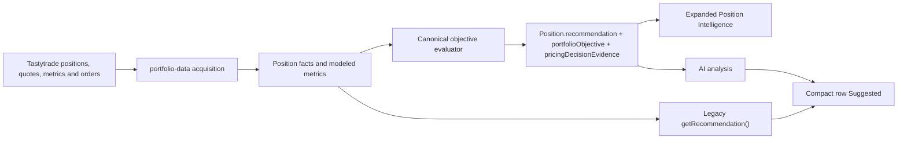

# PM-0002 — Current Portfolio Row Metrics and Suggested-Action Reconciliation Audit

**Date:** 2026-08-10

**Audited branch/base:** `audit/pm-0002-current-portfolio-row-reconciliation` at `2e515ba`

**Scope:** Audit only. No production code or tests changed.
**Primary fixture:** MU 800P/790P bull put spread, five contracts, expiring 2026-09-04, as shown in Dean's 2026-08-10 screenshots.

## 1. Executive decision

The current Portfolio row is **not ready to be treated as fully reconciled**.

The core spread arithmetic visible in the MU fixture is internally consistent: credit, max risk, midpoint buyback, midpoint P/L, marketable close estimate, marketable P/L, target value, strike buffer, and the reason Verify Pricing remains unresolved all reconcile to the current formulas. PI-0014C also correctly prevents stale/degraded marketable evidence from controlling a hard exit.

However, two blockers prevent approval:

1. **Suggested Action has two authorities.** The compact row uses `getRecommendation()` (or an AI mapping after analysis), while the expanded Position Intelligence panel uses the canonical `Position.recommendation` and `portfolioObjective`. That is why the same MU position can show **Manage** in the row and **Verify Pricing** in the expanded panel. The AI header adds a third presentation, **Manage / Low confidence**, even while the deterministic rule says Verify Pricing.
2. **Missing entry premiums are silently converted to zero.** This can corrupt credit, entry-price effect, P/L reliability, CSP Effective Buy, and any downstream metric that depends on entry economics. The CSP fallback also mixes a whole-position dollar credit with a per-share premium if it is ever reached.

The repeated Verify Pricing text after an after-hours refresh is not evidence that several engines independently recommended the same thing. Most of the expanded sections repeat one canonical state. The unresolved state is defensible because the controlling timestamp is the oldest real broker leg-quote timestamp, not the moment the user clicked Refresh. The UI nevertheless fails to show the distinction and therefore makes a successful-but-nonadvancing after-hours refresh look broken.

## 2. Prior-audit disposition

The original `portfolio-position-metrics-audit.md` was completed and later committed. PM-0001 was also completed as scoped through commits `1e28c0c`, `71686a9`, and `195f324`.

PM-0001 correctly fixed:

- multi-lot credit normalization in POP;
- full-credit iron-condor breakevens;
- side-complete, order-independent iron-condor buffer logic;
- null propagation for missing/crossed quotes;
- debit tagging and the debit P/L gate;
- Trade Evolution POP and absolute-delta direction coloring.

It did **not** approve Greek units/thresholds, Net Edge policy, the 50%-target projection, IV normalization, or missing entry-premium provenance. The older audit also predates PI-0014C and contains stale descriptions of quote handling. It is a historical baseline, not current sign-off.

## 3. Current data and decision flow

The split between `R` and `L` is the central decision-integrity defect. Manual action-button availability is a third concern and should remain separate from the recommendation; for example, Cut Losses is intentionally available for any real midpoint loss even when it is not suggested.

## 4. MU screenshot reconciliation

| Item | Screenshot | Reconciliation | Verdict |
|---|---:|---|---|
| Structure | 800P/790P, 5 contracts | $10-wide put credit spread × 5 | Verified |
| Credit | $1,260 | Entry credit used as whole-position dollars | Arithmetically verified; provenance still depends on entry-leg prices |
| Max risk | $3,740 | ($10 × 100 × 5) − $1,260 = $3,740 | Verified theoretical expiration risk, not broker margin |
| Buyback (mid) | $1,600 | Signed leg midpoint/mark aggregation × quantity × 100 | Verified formula; modeled midpoint, not a fill |
| P/L Open | −$340 / −27.0% | $1,260 − $1,600 = −$340; −340/1260 = −26.98% | Verified midpoint P/L |
| Close now | $3,650 | Shorts valued at ask, longs at bid, all legs required | Verified derived marketable estimate; not a firm complex quote |
| Emergency close P/L | −$2,390 / −189.7% | $1,260 − $3,650 = −$2,390; −2390/1260 = −189.68% | Verified formula |
| Mid/marketable gap | $2,050 | $3,650 − $1,600 = $2,050; 54.81% of max risk | Material pricing conflict correctly identified |
| 50% target | $630 | $1,260 × 50% | Verified |
| OTM/buffer | 7.2% | (861.63 − 800) / 861.63 = 7.15% | Verified for bull put spread |
| Theta | +$23/day | Stored raw aggregate is multiplied by 100 for display | Numerically plausible; unit policy not broker-reconciled |
| Gamma | 0.000 | Raw aggregate is absolute-valued and rounded to 3 decimals | Misleading precision: a small nonzero value can display as zero |
| Vega | −0.15 | Raw aggregate shown without ×100 | Unit inconsistent with theta and portfolio-level Greek displays |
| Net Edge | about −$3/day | theta dollars − estimated gamma cost under a 1-sigma IV daily move | Modeled heuristic, not independently validated |
| Verify Pricing | persists | Marketable evidence is degraded/stale and therefore observational | Correct policy result, poorly explained by timestamps in UI |

## 5. Field-by-field audit

### 5.1 Broker-derived or structurally derived fields

| Field | Source/formula | Null/fallback behavior | Classification | Finding |
|---|---|---|---|---|
| Symbol/expiration/strikes/quantity | Broker position legs, canonical structure analysis | Ambiguous structure is blocked/fallback-classified for display | Broker/derived | Generally sound |
| Entry date / entry DTE | First grouped leg's `created-at`; expiration minus entry date | Missing date yields null/zero-age behavior | Broker/derived | IMPORTANT: first leg is not proven to represent the whole complex-order entry |
| Current DTE | Calendar-day difference rounded with JavaScript dates | No exchange-calendar or explicit timezone policy | Derived | IMPORTANT: possible boundary/off-by-one behavior; document canonical policy |
| Stock | Non-crossed underlying bid/ask midpoint, else positive mark | Null when unavailable | Broker/derived | Approved fail-closed behavior |
| GTC / stop | Broker working orders plus canonical stop provenance policy | Unknown provenance remains advisory | Broker/policy | TE-0002 behavior approved; label is not proof of broker execution quality |
| IV / IVR / HV30 | Broker market metrics | Values below 1 are multiplied by 100, then rounded | Broker with heuristic normalization | IMPORTANT: validate against real payload schema per field; do not rely on one generic heuristic |

### 5.2 Entry economics and valuation

| Field | Formula | Classification | Finding |
|---|---|---|---|
| Credit | Sum of short entry premium less long entry premium, × quantity ×100; floored at zero | Derived | BLOCKER: missing/invalid `average-open-price` becomes zero before calculation, so completeness is unknowable |
| Entry effect | Sign of computed net entry value | Derived | BLOCKER: incomplete premiums can be misclassified as Credit/zero rather than Unknown |
| Max Risk | Matched vertical width ×100 × quantity less absolute credit; larger side for IC; naked fallback for unmatched shorts | Modeled expiration risk | Correct formula for supported defined-risk spreads; explicitly not broker buying power or margin |
| Cash Req | Strike ×100 × contracts | Theoretical CSP collateral | Correctly labeled only if understood as fully cash-secured collateral; not option buying power |
| Effective Buy | CSP strike − short-put entry premium | Derived | BLOCKER: missing entry premium becomes 0; fallback to whole-position `creditReceived` is unit-invalid |
| Buyback (mid) | Signed midpoint/mark leg values × quantity ×100 | Derived mark | Correct observational value; null when required pricing absent |
| Close now | Short ask + long bid across every leg × quantity ×100 | Derived marketable estimate | Correctly fail-closed for one-sided/crossed legs; wording must never imply a firm quote/fill |
| P/L Open | Credit − midpoint buyback; broker EOD P/L only as visibly marked fallback | Derived | Correct when entry premium is complete and quotes are reliable |
| Emergency close P/L | Credit − derived marketable close estimate | Derived | Formula correct; the name is alarmist and estimate quality/timestamp should be adjacent |

### 5.3 Modeled opportunity and risk fields

| Field | Formula/assumption | Classification | Finding |
|---|---|---|---|
| POP | Breakeven-based lognormal d2 model using underlying IV and DTE | Model | Units and multi-lot behavior fixed. It is TradeEdge-modeled POP, not broker POP; ignores skew/surface, rates, dividends, and jumps |
| 50% target date | Extrinsic-value approximation using square-root-of-time | Heuristic | Display-only estimate; invalid near/intrinsic positions and not a probability forecast |
| Buffer / OTM% | Strategy-side short-strike distance from stock | Derived | PM-0001 corrected IC side completeness/order invariance; verified for MU BPS |
| Theta | Broker leg theta aggregated with short-positive convention; display ×100 | Broker-derived transformation | Unit should be explicitly `$ / day`; thresholds currently apply to raw aggregate and scale with contracts |
| Gamma | Broker leg gamma aggregated; displayed absolute/raw to 3 decimals | Broker-derived transformation | IMPORTANT: lacks unit and sign; 0.000 can conceal nonzero risk; thresholds not validated |
| Vega | Broker leg vega aggregated; displayed raw/signed | Broker-derived transformation | IMPORTANT: likely represents −$15/IV-point for MU after ×100, yet row shows −0.15; inconsistent with portfolio-level units |
| Net Edge | theta dollars − 0.5 × abs(gamma) × one-day implied move² ×100 | Heuristic | IMPORTANT: rename/describe as modeled theta-minus-gamma estimate; not realized edge or expected daily P/L |
| Trade Evolution | Current values versus first TradeEdge entry snapshot | Historical/model | Baseline is first seen by TradeEdge, not guaranteed trade entry; UI caveat exists but heading can still overstate history |
| What Moved | Current values versus stored prior daily snapshot | Historical/model | Depends on snapshot availability and local/server capture cadence, not a continuous broker history |

## 6. Suggested Action audit

### BLOCKER SA-01 — compact and expanded surfaces do not share one authority

`PositionCard` calculates the compact row recommendation as:

- AI-mapped action after Position Intelligence analysis exists; otherwise
- legacy `getRecommendation(pos, trend)`.

The expanded panel instead consumes the canonical `pos.recommendation`, `pos.portfolioObjective`, and `pos.pricingDecisionEvidence` created by `evaluatePositionObjective()`.

This is not merely a wording mismatch. The legacy engine and canonical evaluator have different rule sets, priority order, confidence concepts, and pricing-state semantics. Sorting also still uses the legacy recommendation. Required correction:

1. Make `Position.recommendation` the sole authority for the compact Suggested field, sorting, priorities, and downstream AI grounding.
2. Treat AI as explanation of the canonical decision, never as a replacement action.
3. Keep manual action availability explicitly separate and never mark a merely available button as suggested.
4. Give every surface the same public label: **Verify Pricing**, not Manage.

### Current canonical precedence

The current objective evaluator correctly allows independent, trustworthy conditions to remain primary—assignment, midpoint-supported material loss, earnings, roll-soon, and let-expire—while unresolved pricing remains secondary. Pricing-dependent fallback/profit actions remain blocked until marketable evidence is decision-eligible. This hierarchy is directionally approved and should not be replaced by the legacy row engine.

### Repetition and confidence

The expanded card repeats the same canonical Verify Pricing state in Suggested Action, Why, Current Concerns, What Would Change, Next Lifecycle Event, management choices, and AI analysis. Repetition is a UX issue, not multiple recommendations. Consolidate to:

- one primary disposition;
- one concise reason;
- one evidence/timestamp panel;
- one next action;
- optional expanded technical rationale.

The deterministic rule should not be shown simultaneously as AI **Low confidence**. Use typed provenance such as **Deterministic rule** versus **AI explanation**, and do not translate a deterministic rule strength into an AI-confidence percentage/category.

## 7. Refresh and timestamp investigation

Three timestamps have different meanings:

| Timestamp | Meaning | Current visibility |
|---|---|---|
| `lastRefresh` | Browser time when the latest full load/recompute successfully completed | Top-level Portfolio “Updated” time only |
| `quoteCapturedAt` / `marketableQuoteCapturedAt` | Oldest valid broker timestamp across every option leg | Included in AI prompt and canonical evidence, not shown adjacent to row pricing/action |
| `recommendation.computedAt` | Time the canonical recommendation was recomputed | Used in intelligence data; not a quote-age substitute |

Freshness is centralized at **120 seconds** and applies only to whether marketable evidence may influence a recommendation. It does not promise a fill and does not trigger execution.

After-hours sequence:

1. User clicks Refresh Quotes.
2. TradeEdge performs one broker refetch and recomputes canonical evidence.
3. `lastRefresh` and `computedAt` advance.
4. If the broker returns unchanged or old leg timestamps, `marketableQuoteCapturedAt` does not advance.
5. Evidence remains stale/degraded/incomplete, so Verify Pricing correctly remains unresolved.
6. There is no automatic retry and no order is sent.

The current success message—“Quotes refreshed; pricing is still unverified”—is truthful but incomplete. It should say whether the broker quote timestamp advanced and why the evidence remains unusable. Required row-level evidence:

- Last refresh attempted/completed: local time;
- Oldest broker leg quote: exact time and age;
- Quote quality: reliable/degraded/incomplete;
- Freshness: fresh/stale/unknown;
- Result: “Broker quote did not advance,” “quotes remain one-sided,” or equivalent;
- Market status context when known (regular session vs after hours), without pretending market status alone proves quote reliability.

Cross-session persistence remains intentionally absent: unresolved provenance survives refreshes within the mounted provider session, but not a hard browser reload. That limitation is disclosed in PI-0014C and remains a future product decision.

## 8. Findings by severity

### BLOCKER

- **PM2-B01 — Dual recommendation authority:** compact Suggested/sorting can contradict canonical Position Intelligence.
- **PM2-B02 — Entry premium provenance collapse:** missing/invalid entry premiums become zero, corrupting dependent fields.
- **PM2-B03 — CSP Effective Buy units:** zero-substitution and whole-position-credit fallback can produce an invalid per-share effective purchase price.

### IMPORTANT

- **PM2-I01 — Timestamp observability:** broker quote time/age and refresh completion time are not distinguished at the point of action.
- **PM2-I02 — Greek unit inconsistency:** Theta, Gamma, and Vega use inconsistent display scales and unlabeled thresholds; MU Gamma rounds a nonzero estimate to 0.000.
- **PM2-I03 — Net Edge policy:** model and thresholds have not been validated as a decision metric; label can imply more certainty than warranted.
- **PM2-I04 — IV normalization:** generic `<1 ×100` heuristic needs real-payload fixtures and per-field schema rules.
- **PM2-I05 — DTE/entry provenance:** first-leg entry date and JavaScript calendar rounding need a documented, tested policy.
- **PM2-I06 — Model labeling:** POP, 50%-target projection, Trade Evolution, and What Moved require explicit provenance/assumption labels.
- **PM2-I07 — Repeated action language:** one state appears in many sections without adding distinct evidence or action.

### POLISH

- Rename “Emergency Close P/L” to “Derived marketable P/L” or similarly neutral language.
- Show more precision or whole-position dollar exposure for small Gamma/Vega values.
- Make “new baseline” persist wherever first-seen history is materially newer than the actual trade.
- Explain that Cash Req and Max Risk are theoretical strategy economics, not broker margin/buying power.

## 9. Required implementation scope after approval

This audit recommends a corrective implementation ticket, not piecemeal UI edits:

1. Introduce typed entry-price provenance/completeness; never parse missing premium as zero.
2. Recompute credit, debit/credit classification, P/L, max risk, targets, and CSP Effective Buy only when required entry inputs are complete.
3. Remove the unit-invalid CSP fallback.
4. Replace compact-row/sort reliance on `getRecommendation()` with canonical `Position.recommendation`; AI remains explanatory only.
5. Add one canonical display adapter so row, Position Intelligence, Today’s Priorities, Priority List, and AI use the same label/action/provenance.
6. Add a visible pricing-evidence block with refresh time, broker quote time/age, quality, freshness, and nonadvancing-after-hours outcome.
7. Define canonical Greek units and strategy/size-aware thresholds, then validate them against realistic broker fixtures.
8. Rename and document modeled fields; prevent display-only heuristics from silently becoming recommendation inputs.
9. Add a realistic MU fixture that reconciles every displayed number and proves the canonical action across collapsed/expanded/AI surfaces.
10. Add missing/invalid-premium, one-sided/crossed/stale quote, after-hours unchanged-timestamp, and multi-lot Greek regression fixtures.

## 10. Acceptance criteria for the corrective ticket

- Every visible field declares broker-derived, derived, modeled, heuristic, historical, or unavailable provenance.
- Missing data remains unavailable; it never becomes zero without broker evidence.
- Every unit is explicit and consistent between row and portfolio aggregates.
- One canonical recommendation kind/label appears on all surfaces.
- AI cannot override or contradict the canonical action.
- A refresh reports both completion time and broker quote time/age.
- An unchanged after-hours quote returns a truthful “refreshed but broker quote did not advance / remains stale” result.
- The MU fixture reconciles credit $1,260, max risk $3,740, midpoint $1,600, midpoint P/L −$340/−27.0%, marketable estimate $3,650, marketable P/L −$2,390/−189.7%, buffer 7.2%, target $630, and Verify Pricing from ineligible marketable evidence.
- No recommendation or execution policy is broadened without explicit product approval.

## 11. Final verdict

**RETURN FOR CORRECTIVE IMPLEMENTATION AFTER TEAM APPROVAL OF UNITS AND MODEL POLICY.**

The current pricing trust boundary is directionally sound, and the MU core spread arithmetic reconciles. The row nevertheless cannot be approved while it has two recommendation authorities and silently fabricated entry-premium zeros. Greek units, timestamp observability, and model labeling must also be resolved before the row can be described as trustworthy end to end.

## 12. Corrective implementation disposition

Implemented on `fix/pm-0002-portfolio-row-correctness` through product commit `ca3aa58`:

- canonical recommendation presentation and sorting;
- AI explanation separated from the canonical action;
- nullable broker entry-premium provenance and fail-closed dependent metrics;
- unit-safe CSP Effective Buy;
- explicit whole-position Greek units with unapproved qualitative thresholds removed;
- broker quote timestamp/age/quality/freshness adjacent to unresolved pricing;
- unchanged-timestamp refresh outcome;
- honest modeled/theoretical labels for affected row fields.

The two pre-existing CSP search test failures recorded in the implementation report are outside PM-0002 and reproduce unchanged on base `2e515ba`.
