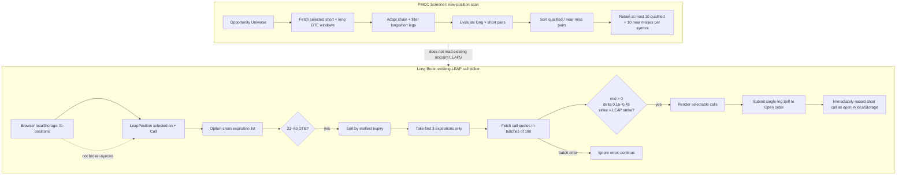

# PMCC Covered-Call Discovery Review

**Review date:** 2026-09-10  
**Reviewer:** Codex  
**Scope:** Long Book’s `+ Call` workflow, the Screener PMCC path, and the adjacent covered-call candidate implementation.

## Decision summary

Do **not** treat the current Long Book `+ Call` picker as a complete PMCC covered-call screener. It is a thin, local-position-backed order picker with undocumented hard caps. It can omit valid contracts, conceal partial market-data failures, and cannot prove that the selected LEAP is still an open, sufficiently covering broker position.

The production Screener PMCC engine is materially more rigorous, but it searches for *new* PMCC pairs from the Opportunity Universe. It is not connected to the account’s existing LEAPS. These are two different workflows that share a label but not a canonical data model or candidate pipeline.

## Logical architecture — current state

## What is working

- The Screener PMCC engine gathers all strikes in the selected DTE windows, evaluates the eligible long/short cross-product, tracks rejection reasons, and exposes retention/safety accounting in its audit disclosure. `app/screener/page.tsx:1197-1248`, `lib/scans/pmccPairing.ts:246-280`.
- The core covered-call library already has a full-universe function, `findAllCoveredCalls`, alongside the one-result `findBestCoveredCall`. `lib/scans/covered-call-finder.ts:101-138`, `354-392`.
- The existing PMCC engine’s 10-pair retention limit is explicit and accounted for; it is not a random data loss. `lib/scans/pmccConfig.ts:33-37`, `lib/scans/pmccPairing.ts:268-275`.

## Findings

### P0 — No broker-verified LEAP foundation or remaining call capacity

Long Book loads its foundations exclusively from `localStorage` (`lb-positions`) and permits a short-call quantity up to the original LEAP contract count. It does not verify the brokerage still holds that LEAP, that it remains open and compatible, or that existing open short calls have already consumed its capacity. `app/long-book/page.tsx:1463-1465`, `1028-1031`, `1622-1624`.

**Impact:** a stale, manually entered, closed, or already-covered LEAP can lead to an additional short-call order. The position tracker may describe that order as covered while the broker account does not.

**Required remediation:** introduce an account-derived `PmccFoundation` and a capacity report keyed by OCC symbol. Available short-call capacity must be `min(open long contracts, broker-recognized coverage) − open/working short calls`, never the saved original quantity.

### P0 — Order state is asserted before a fill is confirmed

After the broker accepts the complex order request, the code immediately saves a `PmccShortCall` with `status: 'open'`. It does not distinguish submitted, working, filled, rejected, or cancelled orders. `app/long-book/page.tsx:1098-1125`.

**Impact:** local capacity and P&L can diverge from the broker, including after an unfilled or cancelled entry.

**Required remediation:** persist an execution record with broker order ID and `working` status, reconcile it from broker order/position data, and mark `open` only after verified fill evidence.

### P1 — The Long Book hides most expirations by design

The call picker first narrows to 21–60 DTE, then sorts by date and calls `slice(0, 3)`. Every valid contract in the fourth and later expiration is absent before strike-level filtering begins. `app/long-book/page.tsx:1043-1050`.

**Impact:** “only a handful” can be correct according to the code while being misleading to the trader. No interface element states the three-expiration cap.

**Required remediation:** fetch all expirations within the user-selected DTE range by default, with paging/bounded concurrency for API safety. Present an explicit result cap only at display time, with total discovered and omitted counts.

### P1 — Essential eligibility and liquidity checks are missing in Long Book

The picker accepts only positive midpoint, a hard-coded delta band of 0.15–0.45, and a strike above the LEAP strike. It does not require a two-sided/non-crossed quote, maximum bid/ask width, minimum open interest, quote recency, short strike above the underlying price, or a viable long-LEAP DTE/delta profile. It writes OI as `0` for every displayed result. `app/long-book/page.tsx:1056-1070`.

**Impact:** a displayed call may be illiquid, stale, ITM versus the stock, or economically unsafe despite appearing as a PMCC candidate.

**Required remediation:** reuse a common PMCC candidate evaluator. Inputs must include live underlying price, verified long-leg state, user-selected DTE/delta/OI/width rules, and quote-quality policy. Return rejection reasons rather than silently dropping contracts.

### P1 — Partial chain failures are silent and indistinguishable from valid scarcity

Both the Long Book picker and Screener PMCC fetch loop discard failed quote batches (`catch {}` / `catch { continue; }`) without surfacing how much of the chain was missing. `app/long-book/page.tsx:1051-1073`, `app/screener/page.tsx:1223-1228`.

**Impact:** a trader cannot tell whether three displayed calls are the full qualified universe or merely what survived a transient data failure.

**Required remediation:** retain batch-level acquisition outcomes. Render “complete / partial / failed” with requested, received, and failed-contract counts; disallow an order when the selected contract’s own data is not complete and fresh.

### P1 — Rules differ across the two PMCC implementations without an explicit contract

Long Book uses fixed 21–60 DTE and 0.15–0.45 delta. The Screener PMCC scan defaults to 0.20–0.30 short delta, 0.70–0.85 long delta, 100 OI on both legs, a quote-quality policy, and debit-below-width. `app/long-book/page.tsx:1036-1069`, `app/screener/page.tsx:7442-7450`, `lib/scans/pmccConfig.ts:1-37`.

**Impact:** a contract can be labelled appropriate in one screen and absent from the other with no explanation; this is implementation drift rather than an intentional strategy choice.

**Required remediation:** one versioned PMCC rules object, with a clear distinction between defaults and user overrides. The existing-LEAP flow should use only the short-leg portion plus long-foundation verification, not reimplement an unrelated subset.

### P2 — Existing PMCC data is local and can persist incorrect lifecycle state

Refresh operations update prices but swallow failures, and the entire record is persisted only in the browser. `app/long-book/page.tsx:1590-1615`. The card also allows a new `+ Call` without consulting its own `openShortCalls` for capacity. `app/long-book/page.tsx:1278-1279`, `1360-1367`.

**Impact:** local P&L, statuses, and coverage can become stale across sessions/devices and lead to duplicate recommendations or orders.

**Required remediation:** treat local state as display cache only; reconcile positions and orders from the account before enabling the order action.

### P2 — The more complete multi-candidate implementation is not used by the Screener CC path

`findAllCoveredCalls` exists but the page calls `findBestCoveredCall` and records one result per symbol. `lib/scans/covered-call-finder.ts:354-392`, `app/screener/page.tsx:1453-1455`, `7931-7933`.

**Impact:** the ordinary stock-covered-call scan still cannot present the full qualifying universe, even though the library supports it.

**Required remediation:** wire the “find all” result path into the session model, then apply sorting and top-N retention after discovery. This is adjacent work, but it should converge with the PMCC fix rather than produce a third discovery design.

### P2 — No dedicated Long Book candidate-discovery or capacity tests

The PMCC pairing and covered-call core modules are tested, including retention accounting, but there are no tests for `SellShortCallModal`’s expiration cap, broker-foundation reconciliation, partial quote batches, order lifecycle, or short-call capacity.

**Impact:** the highest-risk workflow is protected chiefly by manual testing.

**Required remediation:** extract pure acquisition, filtering, eligibility, and capacity modules; add unit tests plus integration tests that mock broker positions, working orders, multi-expiration chains, and partial quote responses.

## Target architecture

## Recommended delivery sequence

1. **Safety foundation:** broker-derived long-call inventory, working-order discovery, capacity calculation, and order-state reconciliation. Disable `+ Call` when capacity is unverified.
2. **Discovery correctness:** extract the Long Book picker’s chain fetch and use all selected expirations; return acquisition diagnostics and all candidate/rejection outcomes.
3. **Rules convergence:** move PMCC short-call eligibility into a shared module and expose DTE, delta, OI, quote-width, strike/spot, and result-count controls.
4. **Presentation:** show qualified calls by default, with near-misses/rejections, total count, and a clear “show top N” display setting that never silently changes discovery.
5. **Regression suite:** cover stale local records, partially loaded chains, a fourth qualifying expiration, one-sided/crossed quotes, existing working short calls, insufficient long capacity, and broker order states.

## Review decision for Ian

Approve a rewrite of the **existing-LEAP PMCC call finder** around broker-verified foundations and a shared candidate engine. Do not incrementally widen the current `slice(0, 3)` picker in isolation: that would increase the number of contracts presented without resolving coverage verification, order-state truth, data-completeness reporting, or rules drift.

## Verification completed

Read-through covered `app/long-book/page.tsx`, `app/screener/page.tsx`, `lib/scans/pmcc*.ts`, and `lib/scans/covered-call-finder.ts`. Targeted automated checks passed: 43 tests across `pmccPairing`, `pmccPairOnDemand`, and `ccFoundationGate`.
